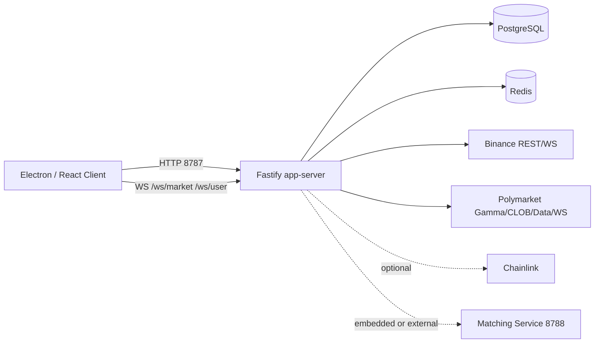
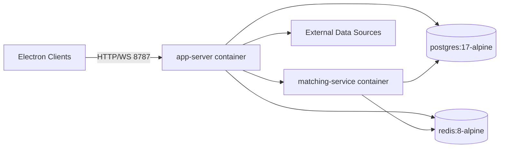
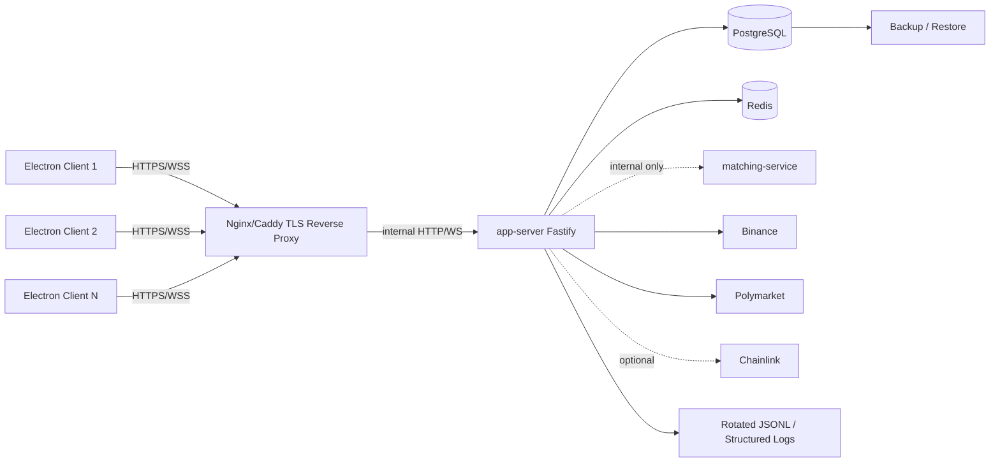
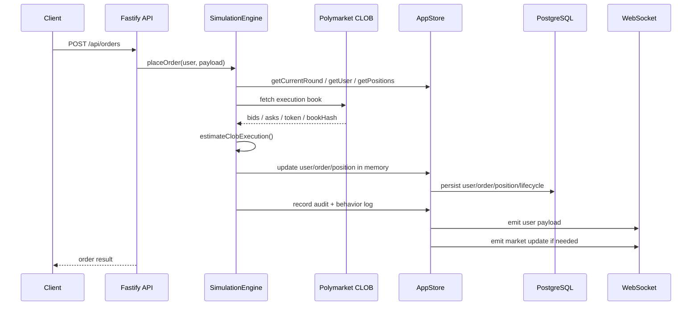
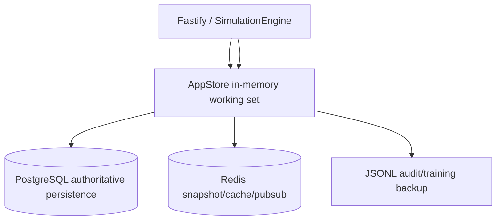
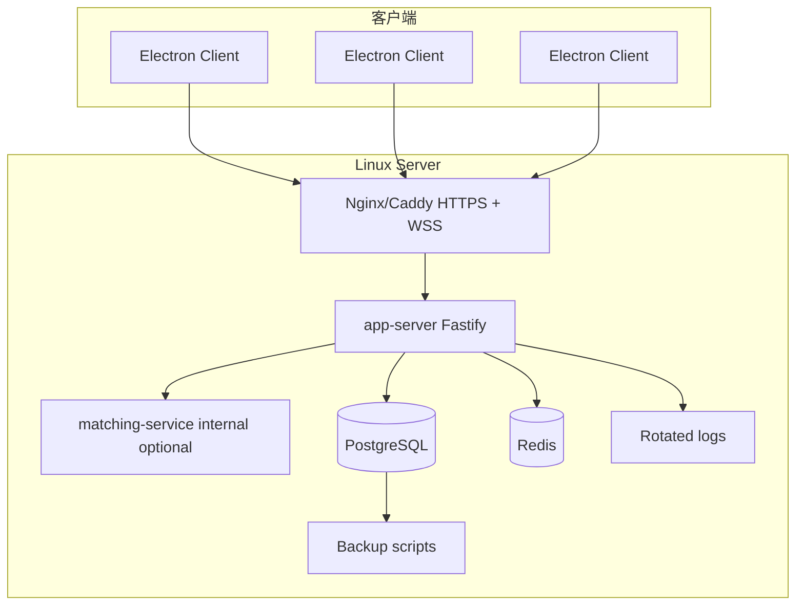
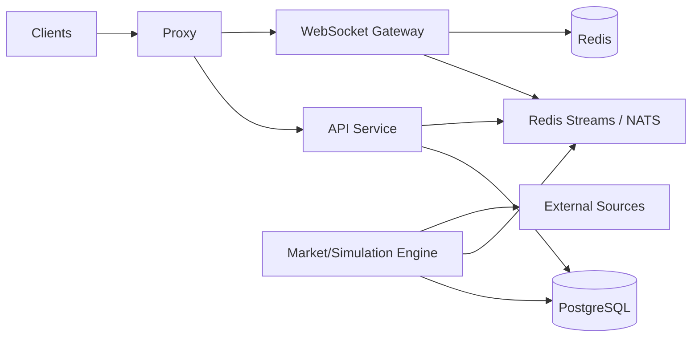

# BTC 5 分钟涨跌模拟盘项目架构说明与 C/S 长期部署优化计划

> 给 Codex 阅读和执行的项目文档。
> 阅读对象：Codex / 后续接手开发者 / 部署维护人员。
> 阅读范围：仓库 `P_T` 的前端、后端、存储、Docker、脚本、现有 docs。
> 项目定位：BTC 5 分钟 UP/DOWN 模拟盘，按 Polymarket BTC 5m 市场和 CLOB 盘口做纸面交易、持仓、结算和日志记录。

---

## 0. 代码阅读与验证说明


### 0.2 已做的可运行验证

执行过：

```bash
npm run typecheck -- --pretty false
```

结果未能完成，因为当前环境没有安装 `node_modules`：

```text
error TS2688: Cannot find type definition file for 'node'.
```

因此，**不能据此判断项目代码本身是否存在 TypeScript 错误**。Codex 接手后的第一步必须是：

```bash
npm ci
npm run typecheck
npm run test:config
npm run test:permissions
npm run test:trading
npm run test:regression
npm run build
```

---

## 1. 总体结论

这是一个已经具备 C/S 架构雏形的 BTC 5 分钟涨跌模拟盘项目。

当前核心结论：

1. **前端是 Electron + React + Vite + Zustand**。Electron 是桌面壳，React 负责 UI，Zustand 负责全局状态，前端通过 HTTP 和 WebSocket 连接后端。
2. **后端是 Fastify + TypeScript**。一个主 app-server 负责认证、权限、行情、轮次、订单、持仓、结算、日志、导出、WebSocket 推送。
3. **交易执行不是用户本地互撮**。主交易链路使用 Polymarket CLOB 外部盘口做纸面成交估算。代码中的独立 matching-service 虽然完整，但当前不是主交易成交依据，主要用于调试、回放或未来扩展。
4. **存储是四层结构**：内存热状态、PostgreSQL 主持久化、Redis 快照缓存/发布、JSONL 审计备份。
5. **现阶段适合单 app-server C/S 部署**。几十人同时使用不建议立刻多实例横向扩展，因为 `AppStore` 目前有大量单进程内存状态。应该先把单实例的事务、WS payload、日志、前端渲染、部署安全和监控做稳。
6. **长期运行最大风险**不是“连接数太多”，而是：WebSocket 高频全量 payload、同步 JSONL 文件写入阻塞、交易多表写入缺少事务、前端根组件过大和高频重渲染、生产安全配置不足、缺少监控备份。

---

## 2. 当前项目结构

### 2.1 根目录

```text
P_T/
  package.json
  package-lock.json
  .env.example
  Dockerfile.server
  docker-compose.local.yml
  docker-compose.deploy.yml
  tsup.server.config.ts
  tsup.matching.config.ts
  README.md
  docs/
  scripts/
  apps/
    client/
    server/
```

### 2.2 关键文件行数与职责

| 文件 | 行数约 | 职责 |
|---|---:|---|
| `apps/client/src/App.tsx` | 5248 | 前端主文件，包含登录、WebSocket、交易页、图表、订单、持仓、日志、用户管理、导出、弹窗等大量逻辑。 |
| `apps/server/src/services/simulation.ts` | 3143 | 后端核心业务引擎：行情同步、轮次状态机、下单、pending 限价单、撤单、平仓、反手、结算、redeem、日志。 |
| `apps/server/src/services/store.ts` | 2969 | 后端主存储层：内存状态、PostgreSQL schema/read/write、Redis 快照、JSONL 日志、权限和查询。 |
| `apps/server/src/index.ts` | 1982 | Fastify 主入口：认证、权限、REST API、WebSocket、健康检查、matching service 启动。 |
| `apps/server/src/services/connectors/polymarket.ts` | 1117 | Polymarket Gamma/CLOB/Data/WS 接入，市场发现、盘口、最近成交、resolved 事件。 |
| `apps/client/src/utils/api.ts` | 868 | 前端 API/DTO 类型和 HTTP/WS URL 封装。当前与服务端类型重复。 |
| `apps/server/src/domain/types.ts` | 812 | 后端领域类型：用户、订单、持仓、轮次、市场快照、日志、权限、matching 等。 |
| `apps/server/src/services/matching/store.ts` | 659 | 独立 matching 服务的 PG/Redis/JSONL 存储。 |
| `apps/server/src/services/connectors/binance.ts` | 532 | Binance REST/WS 接入，BTC 现价和 K 线。 |
| `apps/server/src/services/matching/order-book.ts` | 414 | 独立 matching 服务的价格时间优先订单簿。 |
| `apps/client/electron/main.cjs` | 183 | Electron 主进程，创建窗口；打包测试模式会尝试启动内嵌后端。 |
| `apps/client/src/store/useAppStore.ts` | 191 | Zustand 全局状态。 |
| `apps/server/src/services/clob-execution.ts` | 125 | 按 Polymarket CLOB 盘口估算成交的纯函数。 |
| `apps/server/src/config.ts` | 80 | 服务端环境变量解析。当前缺少生产强校验。 |
| `Dockerfile.server` | 26 | 服务端和 matching-service 镜像构建。当前会 `COPY data ./data`，生产不建议。 |
| `docker-compose.deploy.yml` | 88 | 生产/部署 compose。当前直接暴露 8787/8788，PG 默认弱密码，无 TLS 反代。 |

---

## 3. 当前技术栈

### 3.1 前端

```text
Electron
React 19
Vite 7
Zustand 5
react-i18next / i18next
Recharts
Canvas K 线绘制辅助
```

### 3.2 后端

```text
Node.js / TypeScript
Fastify 5
@fastify/cors
@fastify/websocket
jsonwebtoken
zod
pg
redis
ws
undici
viem
```

### 3.3 数据与外部源

```text
PostgreSQL 17-alpine
Redis 8-alpine
Binance REST / WebSocket
Polymarket Gamma API / CLOB API / Data API / CLOB WebSocket
Chainlink RTDS / RPC，可选，默认本地禁用
JSONL 文件日志
```

---

## 4. 当前运行拓扑

### 4.1 本地开发拓扑



### 4.2 当前 Docker deploy 拓扑



当前 `docker-compose.deploy.yml` 的问题：

- `app-server` 直接通过 `8787:8787` 暴露。
- `matching-service` 直接通过 `8788:8788` 暴露。
- PostgreSQL 用户密码是默认 `postgres/postgres`。
- 没有 Nginx/Caddy TLS 反向代理。
- 没有 Docker secrets。
- 没有备份服务。

### 4.3 推荐的单机 C/S 生产拓扑



推荐阶段一先采用单 app-server。等到几百人规模或多机需求明确后，再拆 WebSocket Gateway、行情引擎、API 服务和消息总线。

---

## 5. 后端架构说明

### 5.1 `apps/server/src/index.ts`：Fastify 主入口

主入口负责：

1. 创建全局 `AppStore`。
2. 创建 `MatchingServiceClient`。
3. 创建 `SimulationEngine`。
4. 根据 `EMBEDDED_MATCHING_SERVICE` 决定是否启动内嵌 matching-service。
5. 初始化存储：PostgreSQL、Redis、内存状态加载、默认用户种子。
6. 注册 CORS 和 WebSocket。
7. 注册 REST API。
8. 注册 `/ws/market` 和 `/ws/user`。
9. 启动 Fastify 监听 `0.0.0.0:PORT`。

当前 Fastify 配置：

```ts
const app = Fastify({ logger: false });
```

生产建议改为结构化 logger，并带 requestId / traceId。

当前 CORS：

```ts
await app.register(cors, {
  origin: true,
  credentials: true
});
```

生产必须改成白名单。

### 5.2 主要 REST API

#### 认证与用户

```text
POST /api/auth/login
GET  /api/me
POST /api/me/language
POST /api/me/password
GET  /api/users
POST /api/users
POST /api/users/bulk
POST /api/users/:id/disable
POST /api/users/:id/enable
POST /api/users/:id/reset-password
POST /api/users/:id/balance
```

#### 轮次、订单、持仓

```text
GET  /api/rounds/current
GET  /api/rounds/history
POST /api/rounds/:id/manual-settlement
GET  /api/profile/rounds/operated
GET  /api/profile/me
GET  /api/positions/me
GET  /api/orders/me
POST /api/orders
POST /api/orders/:id/cancel
POST /api/positions/:id/sell
POST /api/positions/close-side
POST /api/positions/reverse-side
```

#### 日志与导出

```text
GET  /api/logs/me
GET  /api/logs/training
GET  /api/logs/search
GET  /api/logs/facets
GET  /api/logs/export
POST /api/logs/export
GET  /api/logs/training/export
GET  /api/logs/audit
GET  /api/logs/round-activity
GET  /api/logs/audit/export
GET  /api/logs/trade-timeline
```

#### 系统与调试

```text
GET /health
GET /api/system/sources/status
GET /api/system/market/latency
GET /api/matching/books/current
GET /api/matching/books/replay
```

### 5.3 WebSocket 通道

当前有两条 WS：

```text
/ws/market?token=<jwt>
/ws/user?token=<jwt>
```

#### `/ws/market`

当前逻辑：

- 从 query string 读取 `token`。
- 用 JWT 验证 userId。
- 检查用户是否存在、是否 active。
- 初次连接发送一次完整 market payload。
- 监听 `store.emitter.on("market:update")`。
- 每次市场更新时构造并发送 payload。
- 已有 `payloadSeq`、`serverPublishTs`、`bufferedAmount`、coalescing 和 `MARKET_WS_RETRY_MS=25`。

当前 market payload 中包含：

- `currentRound`
- `snapshot`
- `settlementPreview`
- `transportMeta`
- `history`，并且 `history` 调用时传入 `userId`

关键问题：market payload 里混入了用户相关历史/PnL，因此它不是纯公共 payload。几十人同时在线时，服务端每个 market tick 需要给每个用户单独构造 payload，无法复用公共市场数据。

#### `/ws/user`

当前逻辑：

- 从 query string 读取 `token`。
- 用 JWT 验证 userId。
- 初次连接发送完整用户数据。
- 监听 `store.emitter.on("user:${userId}")`。
- 每次用户事件都发送完整：

```ts
{
  profile,
  operatedHistory: getOperatedHistoryWithSettlementPreview(500, user.id),
  positions,
  orders,
  logs
}
```

关键问题：用户流没有 delta，orders/logs/positions 增长后，每次下单、撤单、日志追加都会全量发送。数十人并发时，payload 和前端渲染都会越来越重。

### 5.4 认证与权限

当前认证：

- 登录使用 `store.findUserByCredentials(username, password)`。
- 密码是明文比较。
- JWT payload 包含 `{ userId, role }`。
- JWT 过期时间 12h。

当前权限：

- 项目里有 Tester / Senior Tester / Test Engineer / Admin 等角色。
- 用户、日志、导出、批量操作等接口做了权限检查。
- Senior Tester 关联下级 tester。

生产问题：

- 明文密码必须改成 bcrypt/argon2 hash。
- 默认 JWT secret 必须禁止生产使用。
- 默认账号/默认密码必须禁止生产自动创建或首次启动后强制修改。
- 登录和下单缺少限流。
- WS token 放 URL query 中，可能被代理日志、错误日志、浏览器工具记录。

---

## 6. 业务引擎架构：`SimulationEngine`

### 6.1 核心职责

`apps/server/src/services/simulation.ts` 是业务核心。它负责：

1. 启动 Binance、Polymarket、Chainlink 连接器。
2. 维护 5 分钟轮次状态。
3. 根据外部市场和时间窗口切换 round status。
4. 构建市场 snapshot。
5. 接受用户下单。
6. 用 Polymarket CLOB 当前盘口做纸面成交估算。
7. 管理 pending 限价单。
8. 撤单、平仓、反手。
9. 处理 Polymarket resolved 结算事件。
10. 对胜方持仓执行模拟 redeem。
11. 写 audit log 和 behavior/training log。
12. 触发 user 和 market payload 推送。

### 6.2 轮次状态机

核心 round 数据来自 Polymarket BTC 5m UP/DOWN 市场发现。

轮次包含：

- `roundId`
- `marketId`
- `marketSlug`
- `conditionId`
- `upTokenId`
- `downTokenId`
- `startAt`
- `lockAt`
- `endAt`
- `priceToBeat`
- `status`
- `settledSide`
- `settlementPrice`
- `settlementSource`
- `redeemFinishTs`
- Binance / Polymarket 相关校验字段

交易窗口临近结束时有 freeze window，默认 `FREEZE_WINDOW_MS=10000`。

### 6.3 下单链路

`POST /api/orders` 调用 `SimulationEngine.placeOrder(user, payload)`。

简化流程：



### 6.4 当前成交模型

`apps/server/src/services/clob-execution.ts` 是成交估算纯函数。

规则：

- `buy` 消耗 `book.asks`，按价格从低到高吃单。
- `sell` 消耗 `book.bids`，按价格从高到低吃单。
- limit buy 要求 `price <= limitPrice`。
- limit sell 要求 `price >= limitPrice`。
- market/FOK：必须能完全成交，否则 failed。
- limit/GTC：当前能完全成交则 filled，否则 pending。
- buy 用 notional 推算 qty，卖出用 qty。
- 记录 fills、avgPrice、matchedQty、matchedNotional、unfilledQty、slippage 等。

重点：这是“基于外部盘口的纸面成交”，不是本地用户之间互相成交。

### 6.5 pending 限价单

`processPendingOrders()` 周期性扫描：

```ts
this.store.orders.filter((order) => order.status === "pending")
```

然后：

1. 检查订单所在轮次是否仍可交易。
2. 检查是否进入 freeze window。
3. 获取当前盘口。
4. 再次调用 `estimateClobExecution()`。
5. 若可完全成交，调用 `applyFilledOrder()`。
6. 若轮次结束或 freeze，调用 `failPendingOrder()` 释放冻结资产。

当前问题：pending 扫描依赖数组全量过滤，长期订单多后会越来越慢。应维护 `pendingOrderIds: Set<string>`。

### 6.6 结算与 redeem

结算来源：Polymarket market resolved 事件、Gamma/Data 轮询等。

当 round 确认 settledSide 后：

1. 设置 round settlement 字段。
2. 延迟执行 redeem。
3. 遍历本轮 open positions。
4. 胜方按 `qty * 1` 模拟回款。
5. 败方归零。
6. 关闭 position。
7. 更新 order lifecycle。
8. 写审计和训练日志。
9. round 进入 closed。
10. emit 用户和市场更新。

当前问题：redeem 只靠内存 `round.redeemFinishTs` 防重复，没有数据库级 job/lock/幂等保证；多用户、多 position 更新不在事务中，崩溃时可能半结算。

---

## 7. 存储架构说明

### 7.1 当前存储分层



| 层 | 当前作用 | 当前风险 |
|---|---|---|
| 内存 `AppStore` | 热状态，用户、轮次、订单、持仓、日志、市场快照 | 单进程状态；多实例不一致；数组扫描多；启动只加载有限历史。 |
| PostgreSQL | 主持久化，用户、轮次、订单、持仓、日志、盘口、matching 事件 | 没有正式 migration；关键写入缺少事务；`runDb` 吞写失败。 |
| Redis | 市场 snapshot、source status、pub/sub、matching book cache | 当前不是权威源；故障应降级；尚未用于 WS ticket/限流/跨实例事件。 |
| JSONL | audit 和 training 日志文件备份 | 使用同步 append 和大文件 rewrite，长期运行会阻塞 event loop。 |

### 7.2 `AppStore` 内存状态

主要字段：

```ts
users: Map<string, UserRecord>
rounds: RoundRecord[]
orders: OrderRecord[]
positions: PositionRecord[]
logs: AuditEvent[]
behaviorLogs: BehaviorActionLog[]
orderLifecycleLogs: OrderLifecycleRecord[]
orderBookSnapshots: Map<string, OrderBookSnapshot>
marketSnapshot: MarketSnapshot
```

已有 ID 索引：

```ts
orderIndexById
positionIndexById
orderLifecycleIndexById
```

建议新增热索引：

```ts
ordersByUserId: Map<string, Set<string>>
positionsByUserId: Map<string, Set<string>>
pendingOrderIds: Set<string>
openPositionsByRoundId: Map<string, Set<string>>
openPositionsByRoundSide: Map<string, Set<string>>
roundsById: Map<string, RoundRecord>
ordersByRoundId: Map<string, Set<string>>
```

### 7.3 PostgreSQL schema

当前 schema 在 `store.ts` 的 SQL 字符串中创建和增量 `ALTER TABLE ADD COLUMN IF NOT EXISTS`。

主要业务表：

```text
users
rounds
order_book_snapshots
orders
order_lifecycle_logs
positions
audit_events
behavior_action_logs
```

matching 服务表：

```text
matching_book_snapshots
matching_events
```

#### `users`

保存：

- username
- password
- role
- available_usdc
- permission_codes JSONB
- active/disabled 信息
- senior tester 归属

问题：密码明文，金额 DOUBLE PRECISION。

#### `rounds`

保存：

- round 基本时间
- market slug / condition / token id
- priceToBeat
- settlement/redeem
- Binance/Polymarket 校验字段

#### `orders`

保存：

- user/round/action/side/status
- order_kind/time_in_force/limit_price
- requested/frozen/fill/result
- token/book snapshot/hash
- market slug/condition id
- latency/source age/slippage
- lifecycle 状态

建议新增：

- `client_order_id`
- `request_id` / `trace_id` 唯一索引或外部映射
- DB check constraints

#### `positions`

保存：

- user/round/side
- qty/cost/avgEntry
- realized/unrealized PnL
- lockedQty
- settlement result
- open/closed 状态

#### `audit_events` / `behavior_action_logs`

用于行为审计、训练日志、导出和检索。字段较丰富。

当前问题：日志写 DB 是异步 fire-and-forget，失败只 warn；JSONL 又同步阻塞。需要重新设计日志写入队列和失败指标。

### 7.4 Redis keys

主服务当前写：

```text
market:snapshot:${symbol}
market:sources:${symbol}
market:update:${symbol}  // pub/sub channel
```

matching 服务当前写：

```text
matching:book:${bookKey}:current
```

建议新增：

```text
ws:ticket:${nonce}
rate-limit:${scope}:${key}
engine:round-lock:${roundId}
redeem:lock:${roundId}
market:public:snapshot:${symbol}
```

### 7.5 JSONL 日志

当前文件：

```text
data/logs/audit-events.jsonl
data/logs/behavior-action-logs.jsonl
data/logs/matching-events.jsonl
data/logs/matching-book-snapshots.jsonl
```

当前代码使用：

```ts
appendFileSync(...)
writeFileSync(...)
readFileSync(...)
```

这是长期稳定运行的明显风险。应改为：

- `fs.createWriteStream`
- 内部队列
- backpressure 处理
- 按日期或大小轮转
- 服务关闭时 flush
- retention 删除/压缩整日文件，而不是重写大文件

---

## 8. 外部数据源架构

### 8.1 BinanceConnector

职责：

- Binance WebSocket 订阅 `btcusdt@aggTrade` 和 `btcusdt@kline_1m`。
- REST fallback 轮询现价/K 线。
- 维护 source status。
- 提供 BTC spot price 和 candles。

配置项：

```env
BINANCE_REST_URL
BINANCE_WS_URL
BINANCE_REST_POLL_MS
BINANCE_WS_STALE_MS
BINANCE_REQUEST_TIMEOUT_MS
```

### 8.2 PolymarketConnector

职责：

- Gamma API 市场发现。
- CLOB API 获取 token order book。
- Data API 获取 recent trades。
- CLOB WebSocket 订阅市场事件。
- 识别 market resolved。
- 管理 current/next market 信息。

配置项：

```env
POLYMARKET_GAMMA_BASE_URL
POLYMARKET_CLOB_BASE_URL
POLYMARKET_DATA_BASE_URL
POLYMARKET_MARKET_ID
POLYMARKET_MARKET_SLUG
POLYMARKET_SEARCH_QUERY
POLYMARKET_SERIES_SLUG
POLYMARKET_DISCOVERY_TIMEOUT_MS
POLYMARKET_DISCOVERY_KEYWORDS
MARKET_DISCOVERY_INTERVAL_MS
POLYMARKET_BOOK_POLL_MS
POLYMARKET_TRADES_POLL_MS
```

当前建议：加强请求退避、jitter、并发上限、circuit breaker 和市场发现缓存。

### 8.3 ChainlinkConnector

职责：

- 可选获取 Chainlink BTC/USD 参考价。
- 当前 `.env.example` 默认 `CHAINLINK_ENABLED=false`。

建议：

- 禁用时彻底不发请求。
- 启用时也要退避和超时。
- 不要让 Chainlink 故障影响主交易链路。

---

## 9. 独立 matching-service 的真实作用

目录：

```text
apps/server/src/services/matching/
  app.ts
  client.ts
  order-book.ts
  service.ts
  store.ts
apps/server/src/matching-index.ts
```

能力：

- 价格时间优先订单簿。
- 同步外部盘口 snapshot。
- 执行 order。
- 撤单。
- 记录 matching events。
- 记录 book snapshot。
- 回放某个 bookKey 的订单簿。

REST API：

```text
GET  /health
POST /books/sync
POST /orders/execute
POST /orders/:id/cancel
GET  /books/:bookKey/current
GET  /books/:bookKey/replay
GET  /events/search
```

重要说明：

**当前主交易成交链路不是 matching-service。** 主交易链路在 `SimulationEngine.placeOrder()` 中直接获取 Polymarket CLOB 盘口，然后调用 `estimateClobExecution()`。matching-service 主要用于：

- 调试盘口。
- 回放订单簿。
- 后续扩展成本地模拟撮合。
- 交易质量检查脚本。

Codex 不要误把 matching-service 当成当前真实交易引擎来重构，否则会改错方向。

---

## 10. 前端架构说明

### 10.1 Electron 主进程

文件：`apps/client/electron/main.cjs`

职责：

- 创建 BrowserWindow。
- 开发模式加载 Vite dev server。
- 构建模式加载 renderer 产物。
- 打包测试模式会尝试启动内嵌后端。

当前问题：

- 打包测试模式内嵌后端使用 `PERSISTENCE_MODE=memory` 和本地 `127.0.0.1:8787`，适合测试安装包，不适合长期 C/S 生产客户端。
- C/S 部署中，Electron 应只作为 UI 终端，连接远端服务端 `https://domain` / `wss://domain`。

### 10.2 React 主文件

文件：`apps/client/src/App.tsx`

当前所有核心 UI 和逻辑都集中在这里：

- 登录。
- bootstrap。
- `/ws/market` 连接和重连。
- `/ws/user` 连接和重连。
- 交易表单。
- K 线图。
- 盘口。
- 最近成交/最近轮次。
- 当前持仓。
- 订单列表。
- Profile。
- 用户管理。
- 批量导入。
- 日志搜索。
- 导出。
- timeline dialog。
- 多语言。

问题：

- 文件过大，Codex 修改容易误伤。
- 高频 market payload 可能让大面积组件重渲染。
- UI 和数据连接逻辑混在一起。
- 后续做 WS delta 和 store 分片会很难。

### 10.3 Zustand store

文件：`apps/client/src/store/useAppStore.ts`

保存：

- token
- me
- page
- currentRound
- history
- snapshot
- settlementPreview
- transportMeta
- profile
- operatedHistory
- positions
- orders
- logs
- sourceStatus

已有优点：

- `setMarketPayload()` 有 `payloadSeq` / `serverPublishTs` 乱序保护。
- 收到 payload 后计算 frontend latency。

问题：

- 单 store 保存高频 market 和低频 user/profile/logs，会扩大重渲染影响。
- `setUserPayload()` 是全量替换。
- 组件订阅粒度需要拆细。

### 10.4 API 封装

文件：`apps/client/src/utils/api.ts`

当前：

```ts
const API_BASE_URL = import.meta.env.VITE_API_BASE_URL || "http://127.0.0.1:8787";

createWsUrl(path: string, token: string) {
  return `${base}${path}?token=${encodeURIComponent(token)}`;
}
```

问题：

- WS 直接使用长期 JWT query。
- DTO 类型与后端 `domain/types.ts` 重复定义，长期会漂移。
- 生产客户端服务端地址需要更灵活配置。

---

## 11. 当前主要风险清单

### 11.1 交易一致性风险

当前 `AppStore.runDb()`：

- 如果 PostgreSQL 写失败，只 `console.warn`。
- 不抛出错误。
- 没有事务边界。

交易链路里存在多个独立持久化调用：

- 更新用户余额。
- 写订单。
- 写持仓。
- 写 lifecycle。
- 写 round。

如果中途失败，可能出现：

- 用户余额已在内存扣了，订单没落库。
- 订单 filled，持仓没落库。
- position closed，lifecycle 没更新。
- pending 释放了一半。
- redeem 给部分用户加钱，部分用户没加。

这是上线前必须修的 P0。

### 11.2 WebSocket payload 风险

当前 market/user WS 都偏全量：

- market payload 里有用户相关 history/PnL，无法公共复用。
- user payload 每次发送 profile、operatedHistory 500、positions、orders、logs。
- 连接数是几十人时，压力主要来自重复构造 JSON、序列化、发送、客户端解析和 React 渲染。

### 11.3 同步文件 IO 风险

`appendFileSync` 和 `writeFileSync` 会阻塞 Node event loop。日志高峰或磁盘抖动时，会直接影响：

- 下单响应。
- WebSocket 推送。
- 外部行情处理。
- 健康检查。

### 11.4 前端渲染风险

`App.tsx` 5248 行，根组件和大量 UI 混在一起。market tick 高频更新时，容易造成：

- 交易页整体重渲染。
- 非当前页面重渲染。
- 大列表、图表重复计算。
- Electron 客户端 CPU 占用上升。

### 11.5 安全风险

当前生产风险点：

- CORS `origin: true`。
- WS token 放 URL query。
- 默认 JWT secret。
- 默认用户/默认密码。
- 密码明文存储。
- 登录、下单、导出没有限流。
- 没有 per-user WS 连接上限。
- 生产错误响应和日志未完全分层。

### 11.6 运维风险

- `Dockerfile.server` 把 `data` 复制进镜像。
- deploy compose 直接暴露 app 和 matching 端口。
- 没有 TLS/WSS 反代。
- 没有 secrets。
- 没有备份恢复脚本。
- 没有正式 migration。
- 没有 Prometheus metrics。
- 没有结构化日志和 requestId。

### 11.7 多实例风险

`AppStore` 是单进程内存工作区。当前不应直接启动多个 app-server 副本，因为会出现：

- 每个实例有自己的 users/rounds/orders/positions 内存。
- WebSocket 用户连接分散后看到不同状态。
- pending/redeem 可能重复执行。
- market engine 多个实例重复拉外部 API。

数十人规模应先做单实例稳定部署。

---

## 12. 推荐目标架构

### 12.1 阶段一：几十人长期使用的稳定单实例 C/S



目标：

- 一个 app-server。
- 一个 PostgreSQL。
- 一个 Redis。
- matching-service 只内网访问。
- Nginx/Caddy 只开放 443/80。
- Electron 客户端只连远端 HTTPS/WSS。
- 所有交易关键写入事务化。
- WebSocket 公共市场流和用户私有流拆分。
- 异步日志。
- 有备份、监控、负载测试。

### 12.2 阶段二：更大规模可扩展架构



阶段二的前提：

- 交易命令和市场引擎事件化。
- DB 成为真正权威状态。
- pending/redeem 有分布式锁或 job queue。
- WS gateway 不直接执行交易。
- public market payload 可广播。

当前不建议先做阶段二。

---

## 13. P0 上线前必须完成项

### P0-1：生产配置和启动强校验

#### 需要修改

```text
apps/server/src/config.ts
apps/server/src/index.ts
apps/server/src/services/store.ts
.env.production.example
docs/deployment-production.md
```

#### 目标

生产环境必须 fail fast，不允许带默认弱配置启动。

#### 要新增的配置

```env
NODE_ENV=production
DEPLOY_ENV=production
PORT=8787
MATCHING_SERVICE_PORT=8788
EMBEDDED_MATCHING_SERVICE=false
JWT_SECRET=<strong-random-secret>
CORS_ORIGIN=https://your-domain.example
DATABASE_URL=postgresql://paper_app:<password>@postgres:5432/paper_trading
REDIS_URL=redis://redis:6379
CHAINLINK_ENABLED=false
UPSTREAM_PROXY_URL=
SERVER_STRICT_PERSISTENCE=true
SEED_DEFAULT_USERS=false
ALLOW_DEFAULT_PASSWORD_LOGIN=false
MARKET_WS_MIN_INTERVAL_MS=100
USER_WS_MIN_INTERVAL_MS=250
MAX_WS_CONNECTIONS_PER_USER=3
```

#### 具体要求

1. `buildServerConfig()` 增加：
   - `nodeEnv`
   - `deployEnv`
   - `isProduction`
   - `corsOrigins`
   - `seedDefaultUsers`
   - `allowDefaultPasswordLogin`
   - `strictPersistence`
   - `marketWsMinIntervalMs`
   - `userWsMinIntervalMs`
   - `maxWsConnectionsPerUser`
2. 生产环境启动时校验：
   - `JWT_SECRET` 不能是 `btc-paper-trading-secret`。
   - `CORS_ORIGIN` 必须配置。
   - `DATABASE_URL` 不能是默认 `postgres:postgres`。
   - `SEED_DEFAULT_USERS` 不能默认为 true。
   - `ALLOW_DEFAULT_PASSWORD_LOGIN` 不能为 true。
3. `.env.production.example` 不写真实密码，只写模板。
4. 文档说明如何生成 JWT secret、如何配置客户端 URL。

#### 验收

```bash
npm run typecheck
npm run test:config
```

生产环境缺失关键配置时，服务必须启动失败并输出明确错误。

---

### P0-2：CORS、错误响应和结构化日志基础

#### 需要修改

```text
apps/server/src/index.ts
apps/server/src/http-errors.ts
apps/server/src/config.ts
```

#### 当前问题

```ts
origin: true
logger: false
```

#### 目标

1. 生产只允许白名单 origin。
2. 开发允许 localhost。
3. 生产错误响应不返回 stack。
4. 每个请求有 requestId。
5. 关键交易日志带 traceId。

#### 推荐实现

- Fastify 开启 logger 或接入 pino。
- `CORS_ORIGIN` 支持逗号分隔。
- Error handler：

```ts
{
  code: string,
  message: string,
  requestId: string
}
```

#### 验收

- 非白名单来源被拒绝。
- 开发环境 `localhost:5173` 可用。
- 生产错误不暴露内部 stack。

---

### P0-3：密码安全改造

#### 需要修改

```text
package.json
apps/server/src/services/store.ts
apps/server/src/index.ts
scripts/create-admin.ts
可选 migration SQL
```

#### 当前问题

`findUserByCredentials()` 是明文密码比较。

#### 目标

- 新增 `password_hash` 字段。
- 使用 `argon2` 或 `bcrypt`。
- 老明文密码迁移或要求重置。
- 生产禁止默认密码登录。
- 创建第一个 admin 使用脚本完成，不靠默认种子用户。

#### 推荐任务

1. 安装：

```bash
npm install argon2
```

或：

```bash
npm install bcrypt
npm install -D @types/bcrypt
```

2. 表字段：

```sql
ALTER TABLE users ADD COLUMN IF NOT EXISTS password_hash TEXT;
ALTER TABLE users ADD COLUMN IF NOT EXISTS password_migrated_at BIGINT;
```

3. 登录逻辑改为 verify hash。
4. 修改密码时写 hash。
5. 默认种子用户只在开发环境创建。
6. 新增 `scripts/create-admin.ts`。

#### 验收

- 新用户密码不以明文进入 DB。
- 生产默认账号无法登录。
- 修改密码后可登录，旧密码失败。

---

### P0-4：接口限流

#### 需要修改

```text
package.json
apps/server/src/index.ts
apps/server/src/services/rate-limit.ts
```

#### 目标

防止暴力登录、恶意下单、导出打爆服务。

#### 推荐依赖

```bash
npm install @fastify/rate-limit
```

#### 建议限流

| 接口 | 限制 |
|---|---|
| `POST /api/auth/login` | 每 IP 每分钟 10 次，连续失败可更严格。 |
| `POST /api/orders` | 每用户每秒 5 次，每分钟 60 次。 |
| `POST /api/orders/:id/cancel` | 每用户每秒 5 次。 |
| 日志导出 | 每用户每分钟 2 次。 |
| 批量用户导入 | Admin 每分钟 3 次。 |
| `/api/logs/search` | 每用户每分钟 60 次。 |

Redis 可用时使用 Redis 计数，Redis 不可用时内存 fallback。

#### 验收

- 连续登录失败返回 429。
- 正常交易不受影响。
- rate-limit 日志能看到触发原因。

---

### P0-5：WebSocket ticket 鉴权

#### 需要修改

```text
apps/server/src/index.ts
apps/server/src/services/ws-ticket.ts
apps/client/src/utils/api.ts
apps/client/src/App.tsx 或拆分后的 useMarketSocket/useUserSocket
```

#### 当前问题

```text
/ws/market?token=<long jwt>
/ws/user?token=<long jwt>
```

长期 JWT 在 URL 中可能进入代理日志、浏览器日志、错误日志。

#### 目标

新增短期一次性 WS ticket。

#### 推荐流程

1. 前端使用 Bearer JWT 调用：

```text
POST /api/auth/ws-ticket
```

2. 服务端返回：

```json
{
  "ticket": "...",
  "expiresAt": 1234567890
}
```

3. ticket 内容：

```ts
{
  userId,
  purpose: "ws",
  nonce,
  exp
}
```

4. Redis 可用时：

```text
SET ws:ticket:${nonce} userId EX 60 NX
```

5. WS 连接：

```text
/ws/market?ticket=...
/ws/user?ticket=...
```

6. 连接成功后删除 nonce，实现单次使用。
7. 生产环境禁止直接用长期 JWT query。

#### 验收

- ticket 60 秒后失效。
- Redis 可用时 ticket 重放失败。
- 旧 `/ws/*?token=` 在生产环境不可用。

---

### P0-6：WebSocket heartbeat、连接限制和清理

#### 需要修改

```text
apps/server/src/index.ts
apps/server/src/services/ws-manager.ts
```

#### 目标

长期运行不泄漏连接、listener、timer。

#### 具体要求

1. 服务端定时 ping，建议 25-30 秒。
2. 未收到 pong 则关闭连接。
3. 每用户每通道最大连接数，例如 3。
4. 连接关闭时清理：
   - emitter listener
   - retry timer
   - ping timer
   - pending flags
5. 鉴权失败和 token/ticket 过期不要让前端无限重连。

#### 验收

- 客户端断网后服务端连接数下降。
- 同一用户打开过多客户端时受限制。
- 关闭连接后 emitter listener 数不增长。

---

### P0-7：交易写入事务化和严格持久化

#### 需要修改

```text
apps/server/src/services/store.ts
apps/server/src/services/simulation.ts
```

#### 当前问题

`runDb()` 写失败只 warn，不中断交易。下单、撤单、redeem 无事务。

#### 目标

交易资产变更必须强一致。

#### AppStore 新增事务接口

```ts
import type { PoolClient } from "pg";

async withTransaction<T>(fn: (client: PoolClient) => Promise<T>): Promise<T> {
  this.assertWritablePersistence("transaction");
  const client = await this.pool!.connect();
  try {
    await client.query("BEGIN");
    const result = await fn(client);
    await client.query("COMMIT");
    return result;
  } catch (error) {
    await client.query("ROLLBACK").catch(() => undefined);
    throw error;
  } finally {
    client.release();
  }
}
```

#### 持久化方法支持 client

至少这些方法要支持 `client?: PoolClient`：

```ts
persistUser(user, client?)
persistOrder(order, client?)
persistPosition(position, client?)
persistOrderLifecycle(record, client?)
upsertRound(round, client?)
applyLifecycleExit(..., client?)
settleOpenOrderLifecycles(..., client?)
```

#### 严格持久化

关键交易写入不能再用吞错误的 `runDb()`。建议区分：

```ts
runDbBestEffort()       // 日志、非关键写
runDbStrict()           // 交易关键写，失败抛错
withTransaction()       // 多表关键写
```

#### 下单事务边界

必须在同一事务中完成：

- 用户余额扣减或冻结。
- 订单写入。
- 持仓写入。
- lifecycle 写入。

业务计算和外部盘口获取可以在事务外完成。

#### 撤单事务边界

必须在同一事务中完成：

- pending buy 释放 frozenUsdc。
- pending sell 释放 lockedQty。
- 订单状态改 cancelled。
- 相关持仓/用户保存。

#### pending fail 事务边界

必须在同一事务中完成：

- 释放冻结资产。
- 订单状态改 failed/expired。

#### 验收

新增故障注入测试：

- 模拟写订单失败，余额不改变。
- 模拟写持仓失败，订单不落库。
- 模拟撤单失败，资产不被半释放。
- `npm run test:trading` 通过。

---

### P0-8：redeem 幂等与事务化

#### 需要修改

```text
apps/server/src/services/simulation.ts
apps/server/src/services/store.ts
migration SQL
```

#### 当前问题

redeem 只靠内存字段防重复。崩溃或重复触发可能重复加钱或半结算。

#### 推荐方案

新增 `redeem_jobs` 表，或在 `rounds` 中增加状态锁字段。

示例：

```sql
CREATE TABLE IF NOT EXISTS redeem_jobs (
  round_id TEXT PRIMARY KEY,
  status TEXT NOT NULL,
  started_at BIGINT NOT NULL,
  finished_at BIGINT,
  error_message TEXT
);
```

执行时：

1. `BEGIN`。
2. `INSERT INTO redeem_jobs(round_id,status,started_at) ... ON CONFLICT DO NOTHING`。
3. 如果已存在 finished，则直接返回，不重复执行。
4. 锁定 round 或 job row。
5. 查询 open positions。
6. 更新 users、positions、lifecycle。
7. 更新 round.redeemFinishTs/status。
8. job status finished。
9. `COMMIT`。
10. 事务后写日志和 emit。

#### 验收

- 同一 round 重复触发 redeem，余额只增加一次。
- redeem 中途失败可重试，不产生双倍结算。
- 结算后所有本轮 open positions 都关闭。

---

### P0-9：订单幂等键

#### 需要修改

```text
apps/server/src/domain/types.ts
apps/server/src/index.ts
apps/server/src/services/store.ts
apps/server/src/services/simulation.ts
apps/client/src/utils/api.ts
前端下单组件
migration SQL
```

#### 目标

防止前端重复提交、网络重试造成重复扣款。

#### 新增字段

```sql
ALTER TABLE orders ADD COLUMN IF NOT EXISTS client_order_id TEXT;
CREATE UNIQUE INDEX IF NOT EXISTS idx_orders_user_client_order_id
  ON orders(user_id, client_order_id)
  WHERE client_order_id IS NOT NULL;
```

#### 前端

每次用户点击下单时生成：

```ts
clientOrderId = crypto.randomUUID()
```

请求重试使用同一个 `clientOrderId`。

#### 后端

- 收到 `clientOrderId` 后先查已存在订单。
- 存在则返回已有订单，不重复执行。
- 不存在才继续正常交易。

#### 验收

- 同一 `clientOrderId` 连续提交，只生成一笔订单。
- 余额只扣一次。

---

### P0-10：异步 JSONL 日志与日志轮转

#### 需要修改

```text
apps/server/src/services/log-writer.ts
apps/server/src/services/store.ts
apps/server/src/services/matching/store.ts
apps/server/src/index.ts
```

#### 当前问题

使用 `appendFileSync()` 和 `writeFileSync()`。

#### 目标

日志写入不能阻塞事件循环。

#### 新增 LogWriter

建议能力：

```ts
class JsonlLogWriter {
  write(record: unknown): Promise<void> | void;
  flush(): Promise<void>;
  close(): Promise<void>;
  getStats(): { queueLength; dropped; writeErrors; currentFile; };
}
```

实现要求：

- `fs.createWriteStream`。
- 顺序队列。
- backpressure `drain`。
- 按日期切分：`audit-events-YYYY-MM-DD.jsonl`。
- 按大小切分：例如 256MB。
- 关闭服务时 flush。
- retention 删除或 gzip 整日文件，不重写大文件。

#### 验收

- `grep -R appendFileSync apps/server/src` 不再出现在高频路径。
- 高频下单/日志时 event loop lag 不明显上升。
- 服务退出前日志 flush。

---

## 14. P1 数十人长期使用性能优化

### P1-1：WebSocket 公共市场流和用户私有流拆分

#### 需要修改

```text
apps/server/src/index.ts
apps/server/src/services/store.ts
apps/client/src/utils/api.ts
apps/client/src/store/useAppStore.ts
前端 WS hook
```

#### 当前问题

market WS 是用户特定 payload，user WS 是全量 payload。

#### 目标协议

##### 公共市场流

```text
/ws/market/public?ticket=...
```

payload：

```ts
{
  type: "market_snapshot" | "market_delta" | "full_snapshot_required",
  seq: number,
  serverPublishTs: number,
  currentRound,
  snapshot: {
    symbol,
    marketId,
    marketSlug,
    serverNow,
    binancePrice,
    priceToBeat,
    displayPrices,
    orderBooks,       // top N
    recentTrades,     // top N
    candles,          // compact or delta
    sources,
    uiMeta
  },
  settlementPreview
}
```

公共 payload 每个 tick 只构造一次，所有用户复用。

##### 用户私有流

```text
/ws/user?ticket=...
```

支持事件类型：

```ts
{ type: "profile", data }
{ type: "order_upsert", data }
{ type: "position_upsert", data }
{ type: "log_append", data }
{ type: "operated_round_upsert", data }
{ type: "full_sync", data }
{ type: "full_sync_required", reason }
```

#### 历史和 PnL

- 初次登录通过 `/api/bootstrap/full` 或 user full sync 获取。
- 高频 market tick 不发送用户 PnL history。
- 用户下单、平仓、结算后，再发对应 operated round upsert。

#### 验收

- 30 个客户端在线时，公共 market payload 每 tick 只构造一次。
- `/ws/user` 不再每次发送所有 orders/logs/history。
- 断线重连后可 full sync 恢复。

---

### P1-2：WebSocket 发送频率、payload 大小和 backpressure 指标

#### 需要修改

```text
apps/server/src/services/metrics.ts
apps/server/src/index.ts
```

#### 指标

```text
market_ws_connections
user_ws_connections
market_ws_payload_bytes
user_ws_payload_bytes
market_ws_send_duration_ms
user_ws_send_duration_ms
ws_buffered_amount
ws_coalesced_count
ws_dropped_due_backpressure
ws_seq_gap
```

#### 建议阈值

- market 公共流最小发送间隔：100ms 或更高。
- user 私有流最小发送间隔：250ms。
- 单连接 `bufferedAmount` 超阈值时跳过中间 market delta，只保留最新 snapshot。

#### 验收

- `/metrics` 或 `/health` 能看到 payload bytes 和连接数。
- 慢客户端不会拖垮服务端。

---

### P1-3：前端 `App.tsx` 拆分

#### 需要修改

```text
apps/client/src/App.tsx
apps/client/src/app/**
apps/client/src/features/**
apps/client/src/shared/**
```

#### 推荐结构

```text
apps/client/src/
  app/
    App.tsx
    AppShell.tsx
    ErrorBoundary.tsx
  features/
    auth/
      LoginPage.tsx
      useAuthBootstrap.ts
    market/
      useMarketSocket.ts
      useUserSocket.ts
      MarketHeader.tsx
      CandleChart.tsx
      OrderBookPanel.tsx
      RecentTradesPanel.tsx
      RecentRoundsPanel.tsx
      SourceStatusPanel.tsx
    trading/
      TradePage.tsx
      OrderPanel.tsx
      PositionsPanel.tsx
      OrdersPanel.tsx
      QuickActions.tsx
    profile/
      ProfilePage.tsx
    logs/
      LogSearchPage.tsx
      LogExportDialog.tsx
      TimelineDialog.tsx
      RoundLogDialog.tsx
    users/
      UserManagementPage.tsx
      BulkUserDialog.tsx
  store/
    useAuthStore.ts
    useMarketStore.ts
    useUserDataStore.ts
    useUiStore.ts
  shared/
    components/
    hooks/
    formatters/
```

#### 拆分原则

1. 先移动代码，不改业务逻辑。
2. 每搬一个 feature 就跑 typecheck/build。
3. 先拆 WS hooks、TradePage、LogSearchPage、UserManagementPage。
4. `App.tsx` 最终只保留 shell、路由和全局 provider。

#### 验收

- `App.tsx` 降到 300 行以内。
- 功能保持一致。
- `npm run build:renderer` 通过。

---

### P1-4：Zustand store 分片与 selector 优化

#### 需要修改

```text
apps/client/src/store/**
各 feature 组件
```

#### 目标

高频 market 更新不让日志页、用户管理页、profile 等低频组件重渲染。

#### 推荐分片

```text
useAuthStore
useMarketStore
useUserDataStore
useUiStore
```

#### 订阅原则

组件只订阅自己需要的字段：

```ts
const snapshot = useMarketStore((s) => s.snapshot);
const positions = useUserDataStore((s) => s.positions);
const page = useUiStore((s) => s.page);
```

使用 shallow compare：

```ts
import { useShallow } from "zustand/react/shallow";
```

#### 验收

- market tick 不导致非交易页频繁重渲染。
- React Profiler 中重渲染范围明显缩小。

---

### P1-5：图表、盘口和大列表渲染优化

#### 目标

Electron 客户端长期运行不卡顿。

#### 建议

1. K 线 Canvas 绘制用 `requestAnimationFrame` 合并。
2. 高频快照只更新当前 candle，不重算全部 candles。
3. 盘口默认只渲染 top 10/20，更多档位按需展开。
4. logs/orders 长列表使用虚拟列表或服务端分页。
5. 导出/搜索结果不要一次性塞入 UI。
6. 对昂贵计算使用 `useMemo`，但不要滥用。

#### 验收

- 1 秒 market tick 下 UI 不明显卡顿。
- 30 个客户端在线时单客户端 CPU 占用稳定。

---

### P1-6：数据库热点索引和内存索引

#### 需要修改

```text
migration SQL 或 store init SQL
apps/server/src/services/store.ts
```

#### 建议数据库索引

```sql
CREATE INDEX IF NOT EXISTS idx_orders_status_round_created
  ON orders(status, round_id, created_at DESC);

CREATE INDEX IF NOT EXISTS idx_orders_user_status_created
  ON orders(user_id, status, created_at DESC);

CREATE INDEX IF NOT EXISTS idx_orders_round_created
  ON orders(round_id, created_at DESC);

CREATE INDEX IF NOT EXISTS idx_positions_round_status_side
  ON positions(round_id, status, side);

CREATE INDEX IF NOT EXISTS idx_positions_user_round_status
  ON positions(user_id, round_id, status);

CREATE INDEX IF NOT EXISTS idx_rounds_market_slug
  ON rounds(market_slug);

CREATE INDEX IF NOT EXISTS idx_rounds_status_end_at
  ON rounds(status, end_at DESC);

CREATE INDEX IF NOT EXISTS idx_audit_events_user_ts_event
  ON audit_events(user_id, server_recv_ts DESC, event_id DESC);

CREATE INDEX IF NOT EXISTS idx_behavior_logs_user_ts_log
  ON behavior_action_logs(tester_id_anon, timestamp_ms DESC, log_id DESC);
```

#### 建议内存索引

```ts
pendingOrderIds: Set<string>
ordersByUserId: Map<string, Set<string>>
positionsByUserId: Map<string, Set<string>>
openPositionsByRoundId: Map<string, Set<string>>
openPositionsByRoundSide: Map<string, Set<string>>
```

#### 验收

- pending 处理不再扫描全部 orders。
- 用户 payload 构造不扫描全体订单和持仓。
- redeem 查询本轮 open positions 更快。

---

### P1-7：日志搜索 keyset pagination

#### 当前问题

日志搜索 cursor 本质还是 offset cursor，大数据量时会越来越慢。

#### 目标

改为基于时间和 id 的 keyset pagination。

#### 示例 SQL

```sql
WHERE (server_recv_ts, event_id) < ($cursorTs, $cursorEventId)
ORDER BY server_recv_ts DESC, event_id DESC
LIMIT $limit
```

training logs：

```sql
WHERE (timestamp_ms, log_id) < ($cursorTs, $cursorLogId)
ORDER BY timestamp_ms DESC, log_id DESC
LIMIT $limit
```

#### 前端

- cursor 存 `{ ts, id }` 的 base64 JSON。
- 不再用大 offset。

#### 验收

- 深分页性能稳定。
- 大日志量下查询不出现明显延迟上升。

---

### P1-8：导出流式化

#### 当前风险

导出可能一次性把大量日志/订单/用户数据组装到内存。

#### 目标

大导出不阻塞主服务、不导致 heap 暴涨。

#### 建议

1. PostgreSQL cursor 分批读取。
2. CSV row streaming。
3. ZIP streaming。
4. 限制单次导出范围。
5. 大导出可以变成异步 job，先生成临时文件后下载。
6. 临时文件定期清理。

#### 验收

- 导出 5 万行级别数据时 heap 稳定。
- 导出期间下单和 WS 不明显受影响。

---

### P1-9：外部连接器退避、限速、缓存和降级

#### 需要修改

```text
apps/server/src/services/connectors/binance.ts
apps/server/src/services/connectors/polymarket.ts
apps/server/src/services/connectors/chainlink.ts
apps/server/src/services/connectors/retry.ts
apps/server/src/services/connectors/rate-limiter.ts
apps/server/src/services/connectors/circuit-breaker.ts
```

#### 目标

外部 API 失败时不形成请求风暴，服务本地功能可降级运行。

#### 要求

1. 指数退避 + jitter。
2. 请求并发上限。
3. 超时明确。
4. 连续失败后 circuit breaker 短暂打开。
5. Polymarket market discovery 结果缓存。
6. 当前 market/next market token 缓存。
7. 数据源 stale 时 UI 明确显示 degraded。
8. 行情太旧时限制 market order 或要求确认。

#### 验收

- 断开代理或外网时，服务不会疯狂请求。
- health 中 source status 明确显示 degraded/stale。
- 本地用户查询、日志、已持仓查看仍可用。

---

## 15. P2 工程化和生产运维优化

### P2-1：正式 migration 系统

#### 当前问题

schema 和 `ALTER TABLE ADD COLUMN IF NOT EXISTS` 写在 `store.ts` 中。长期演进不可控。

#### 推荐目录

```text
migrations/
  001_init.sql
  002_add_password_hash.sql
  003_add_client_order_id.sql
  004_add_redeem_jobs.sql
  005_add_hot_indexes.sql
```

#### 可选工具

- `node-pg-migrate`
- `drizzle-kit`
- `knex migrations`
- 自研简单 migration runner

#### 验收

- 空库可 migration 初始化。
- 旧库可升级。
- 应用启动只检查 schema version，不再无条件改表。

---

### P2-2：数据库约束和金额类型治理

#### 推荐约束

```sql
ALTER TABLE orders ADD CONSTRAINT orders_side_check CHECK (side IN ('up','down'));
ALTER TABLE orders ADD CONSTRAINT orders_action_check CHECK (action IN ('buy','sell'));
ALTER TABLE orders ADD CONSTRAINT orders_status_check CHECK (status IN ('pending','filled','failed','cancelled'));
ALTER TABLE positions ADD CONSTRAINT positions_qty_nonnegative CHECK (qty >= 0);
ALTER TABLE users ADD CONSTRAINT users_available_usdc_nonnegative CHECK (available_usdc >= 0);
```

#### 金额类型

当前大量使用 `DOUBLE PRECISION` 和 TS `number`。模拟盘可运行，但长期建议改为：

方案 A：整数微单位。

```text
1 USDC = 1_000_000 microUSDC
qty_micro BIGINT
price_micro INT
```

方案 B：`NUMERIC(20,8)` + Decimal 库。

短期建议：先封装金额工具，避免散落 `number` 运算；后续迁移 DB 类型。

#### 验收

- 不出现负零、微小负余额。
- 金额保留规则统一。

---

### P2-3：共享类型包

#### 当前问题

`apps/client/src/utils/api.ts` 和 `apps/server/src/domain/types.ts` 有大量重复 DTO。

#### 推荐

```text
packages/shared/src/types.ts
packages/shared/src/schemas.ts
```

或：

```text
apps/shared/src/types.ts
```

要求：

- 只放纯类型和 zod schema。
- 不引入 Node-only 模块。
- client/server 同时引用。

#### 验收

- `OrderRecord`、`PositionRecord`、`MarketSnapshot` 等不再重复定义。
- DTO 改动能同时触发前后端 typecheck。

---

### P2-4：Prometheus metrics 和告警

#### 需要修改

```text
package.json
apps/server/src/services/metrics.ts
apps/server/src/index.ts
业务/WS/连接器埋点
```

#### 推荐依赖

```bash
npm install prom-client
```

#### 新增 endpoint

```text
GET /metrics
```

生产中限制内网访问或 Basic Auth。

#### 指标清单

```text
nodejs_event_loop_lag_seconds
nodejs_heap_size_used_bytes
http_request_duration_seconds
http_requests_total
ws_connections{channel}
ws_payload_bytes{channel}
ws_send_duration_seconds{channel}
pg_pool_total
pg_pool_idle
pg_pool_waiting
pg_query_duration_seconds
redis_operation_duration_seconds
order_place_duration_seconds
order_status_total{status}
pending_orders_total
redeem_duration_seconds
redeem_failures_total
source_status{source,state}
external_request_duration_seconds{source,api}
log_queue_length
log_write_failures_total
```

#### 告警建议

- PG 不可写。
- Redis 长时间不可用。
- 外部数据源全部 stale/degraded。
- event loop lag > 200ms 持续 1 分钟。
- heap 使用超过 80%。
- WS bufferedAmount 高。
- 日志队列积压。
- 下单失败率异常升高。

---

### P2-5：Docker 和反向代理部署

#### 当前 Dockerfile 问题

```dockerfile
COPY data ./data
```

生产镜像不应包含本地 data。

#### 推荐修改

1. 删除 `COPY data ./data`。
2. 创建非 root 用户运行 Node。
3. `/app/data/logs` 使用 volume。
4. `.env`、本地 PG/Redis 数据不进镜像。
5. 设置 `NODE_ENV=production`。

#### 反向代理

推荐 Caddy：

```text
your-domain.example {
  reverse_proxy app-server:8787
}
```

或 Nginx，必须支持：

- HTTPS。
- WebSocket upgrade。
- `/ws/*` 长连接。
- request body 限制。
- access log。
- upstream timeout。

#### compose 目标

- 只对外暴露 80/443。
- app-server、matching-service 只在 Docker network 内部访问。
- PostgreSQL 密码用 secret 或环境变量，不用默认。
- matching-service 不直接暴露公网。
- 加 backup service 或宿主机 cron。

#### 验收

- Electron 客户端通过 `https://domain` 和 `wss://domain` 正常连接。
- 外网不能直接访问 8787/8788。

---

### P2-6：PostgreSQL 备份和恢复

#### 新增文件

```text
scripts/backup-postgres.sh
scripts/restore-postgres.sh
docs/backup-restore.md
```

#### 推荐策略

- 每日 `pg_dump`。
- 保留本地 7 天。
- 远程/对象存储保留 30-90 天。
- 每月至少一次恢复演练。
- 更成熟方案：pgBackRest 或 WAL 归档。

#### Redis

Redis 不是权威源，允许空 Redis 启动，服务重新构建快照。

#### JSONL

按日期 gzip 归档，和 PG 备份一起保存。

#### 验收

- 能把备份恢复到新库。
- 恢复后 users/orders/positions/rounds/logs 可查。

---

## 16. P3 更大规模架构扩展

只有当用户数上升到几百、或需要多机高可用时再做。

### P3-1：拆分 Market/Simulation Engine

把行情和轮次状态机从 API 服务拆出来。

```text
market-engine
api-service
ws-gateway
```

### P3-2：消息总线

可选：

- Redis Streams
- NATS
- Kafka

事件：

```text
market.snapshot.updated
round.status.changed
order.created
order.filled
position.updated
redeem.completed
user.log.appended
```

### P3-3：WS Gateway

WS gateway 只负责：

- 鉴权。
- 订阅。
- 推送。
- 心跳。
- backpressure。

不执行交易。

### P3-4：分布式锁和 job queue

pending/redeem/round settlement 必须通过：

- PostgreSQL advisory lock。
- Redis lock。
- BullMQ。
- pg-boss。

当前阶段不要直接多副本 app-server。

---

## 17. Codex 执行任务卡

### Task 01：基线检查

执行：

```bash
npm ci
npm run typecheck
npm run test:config
npm run test:permissions
npm run test:trading
npm run test:regression
npm run build
```

输出：

- 失败项。
- 修复记录。
- 不能跳过 typecheck/build。

---

### Task 02：生产配置模板和强校验

文件：

```text
apps/server/src/config.ts
.env.production.example
docs/deployment-production.md
```

完成：P0-1。

验收：`npm run test:config`。

---

### Task 03：CORS、错误响应、requestId

文件：

```text
apps/server/src/index.ts
apps/server/src/http-errors.ts
```

完成：P0-2。

验收：非白名单 origin 被拒绝，生产错误不暴露 stack。

---

### Task 04：密码 hash 和默认账号禁用

文件：

```text
apps/server/src/services/store.ts
apps/server/src/index.ts
scripts/create-admin.ts
migrations/002_add_password_hash.sql
```

完成：P0-3。

验收：DB 不再保存新明文密码。

---

### Task 05：接口限流

文件：

```text
apps/server/src/index.ts
apps/server/src/services/rate-limit.ts
package.json
```

完成：P0-4。

验收：登录暴力请求返回 429。

---

### Task 06：WS ticket 鉴权

文件：

```text
apps/server/src/services/ws-ticket.ts
apps/server/src/index.ts
apps/client/src/utils/api.ts
前端 WS hook
```

完成：P0-5。

验收：ticket 过期/重放失败。

---

### Task 07：WS heartbeat 和连接治理

文件：

```text
apps/server/src/services/ws-manager.ts
apps/server/src/index.ts
```

完成：P0-6。

验收：断网连接清理，无 listener 泄漏。

---

### Task 08：AppStore 事务接口

文件：

```text
apps/server/src/services/store.ts
```

完成：P0-7 的 store 部分。

验收：persist 方法兼容 client；原调用不破坏。

---

### Task 09：下单、撤单、pending fail 事务化

文件：

```text
apps/server/src/services/simulation.ts
apps/server/src/services/store.ts
scripts/trading-engine-check.ts
```

完成：P0-7 的业务部分。

验收：故障注入不出现半更新。

---

### Task 10：redeem 幂等和事务化

文件：

```text
apps/server/src/services/simulation.ts
apps/server/src/services/store.ts
migrations/004_add_redeem_jobs.sql
```

完成：P0-8。

验收：重复结算不重复加钱。

---

### Task 11：订单幂等键

文件：

```text
apps/server/src/domain/types.ts
apps/server/src/services/simulation.ts
apps/server/src/services/store.ts
apps/client/src/utils/api.ts
前端下单组件
migrations/003_add_client_order_id.sql
```

完成：P0-9。

验收：同一 clientOrderId 不重复扣款。

---

### Task 12：异步日志和日志轮转

文件：

```text
apps/server/src/services/log-writer.ts
apps/server/src/services/store.ts
apps/server/src/services/matching/store.ts
apps/server/src/index.ts
```

完成：P0-10。

验收：无高频 appendFileSync，服务关闭前 flush。

---

### Task 13：市场 WS 公共 payload 缓存

文件：

```text
apps/server/src/index.ts
apps/server/src/services/store.ts
apps/client/src/store/useAppStore.ts
apps/client/src/utils/api.ts
```

完成：P1-1 第一阶段。

验收：公共 market payload 每 tick 只构造一次。

---

### Task 14：用户 WS delta 化

文件：

```text
apps/server/src/index.ts
apps/server/src/services/store.ts
apps/client/src/store/useAppStore.ts
```

完成：P1-1 第二阶段。

验收：下单只推送相关 order/position/log/profile 变更。

---

### Task 15：前端拆分

文件：

```text
apps/client/src/App.tsx
apps/client/src/features/**
apps/client/src/app/**
```

完成：P1-3。

验收：`App.tsx` 小于 300 行，renderer build 通过。

---

### Task 16：Zustand 分片和渲染优化

文件：

```text
apps/client/src/store/**
apps/client/src/features/**
```

完成：P1-4、P1-5。

验收：market tick 不让日志页/用户页重渲染。

---

### Task 17：数据库索引、内存索引、keyset pagination

文件：

```text
migrations/005_add_hot_indexes.sql
apps/server/src/services/store.ts
apps/client/src/features/logs/**
```

完成：P1-6、P1-7。

验收：pending 不全表/全数组扫描；深分页稳定。

---

### Task 18：连接器可靠性

文件：

```text
apps/server/src/services/connectors/**
```

完成：P1-9。

验收：外部 API 故障不触发请求风暴。

---

### Task 19：migration 系统和 DB 约束

文件：

```text
migrations/**
scripts/migrate.ts
apps/server/src/services/store.ts
```

完成：P2-1、P2-2。

验收：空库和旧库都可迁移。

---

### Task 20：metrics 和结构化日志

文件：

```text
apps/server/src/services/metrics.ts
apps/server/src/index.ts
业务埋点文件
```

完成：P2-4。

验收：Prometheus 可 scrape。

---

### Task 21：Docker、反代、生产 compose

文件：

```text
Dockerfile.server
docker-compose.deploy.yml
deploy/Caddyfile 或 deploy/nginx.conf
docs/deployment-production.md
```

完成：P2-5。

验收：只对外暴露 80/443，HTTPS/WSS 可用。

---

### Task 22：备份恢复脚本

文件：

```text
scripts/backup-postgres.sh
scripts/restore-postgres.sh
docs/backup-restore.md
```

完成：P2-6。

验收：实际恢复一次成功。

---

### Task 23：负载和浸泡测试

新增：

```text
scripts/load/ws-load-test.ts
scripts/load/order-load-test.ts
scripts/load/soak-test.md
```

测试目标：

1. 10/30/50 个 WS 客户端连接 market/user。
2. 模拟下单、撤单、日志查询。
3. 记录 p50/p95/p99 延迟。
4. 记录 heap、event loop lag、WS payload bytes。
5. 模拟 Redis 重启、Polymarket 连接失败、客户端断线重连。

验收建议：

- 30 并发客户端稳定运行 2 小时，无内存持续增长。
- 50 客户端可连接、重连、持续收到市场数据。
- 无重复扣款。
- 无重复 redeem。
- 无负余额。
- 无 pending 锁死。
- 日志队列不长期积压。

---

## 18. 最小上线版本建议

要先给数十人使用，最小上线前必须完成：

1. 生产配置强校验。
2. 禁止默认 JWT secret、默认账号、默认密码。
3. 密码 hash。
4. CORS 白名单。
5. 登录/下单/导出限流。
6. WS ticket。
7. WS heartbeat 和连接清理。
8. 下单、撤单、pending fail、redeem 事务化。
9. 订单幂等键。
10. 异步 JSONL 日志。
11. market 公共 payload 缓存。
12. user payload 节流或 delta 化第一版。
13. Docker 不复制 data。
14. 反向代理 HTTPS/WSS。
15. PostgreSQL 备份和恢复演练。
16. 30 客户端 2 小时浸泡测试。

---

## 19. 验收矩阵

| 类别 | 必须验收 |
|---|---|
| 类型与构建 | `npm run typecheck`、`npm run build` 通过。 |
| 配置 | 生产弱配置 fail fast。 |
| 认证 | 密码 hash，默认账号禁用，JWT secret 强制。 |
| 权限 | 现有权限测试通过。 |
| 交易 | market/FOK、limit/GTC、pending、撤单、平仓、反手、redeem 全通过。 |
| 一致性 | PG 写失败故障注入不产生余额/订单/持仓半更新。 |
| 幂等 | 重复 `clientOrderId` 不重复扣款；重复 redeem 不重复加钱。 |
| WS | ticket、heartbeat、连接上限、断线清理、seq gap full sync。 |
| 性能 | 30-50 客户端同时在线，CPU/heap/event loop lag 可控。 |
| 日志 | 高频日志不阻塞；可查、可导出、可归档。 |
| DB | 热点索引生效；日志 keyset pagination。 |
| 运维 | Docker 不含 data；HTTPS/WSS；PG 备份恢复成功。 |
| 监控 | `/metrics` 暴露关键指标；告警阈值明确。 |

---

## 20. Codex 修改注意事项

1. 不要把 matching-service 当成当前主交易成交引擎。主成交路径是 `SimulationEngine.placeOrder()` + `clob-execution.ts`。
2. 不要直接启动多个 app-server 副本。当前 `AppStore` 是单进程内存状态。
3. 交易资产变更必须先保证一致性，再做性能优化。
4. 前端拆分第一阶段只搬代码，不改业务逻辑。
5. WS 协议变化必须保留 full sync fallback。
6. 生产安全项应 fail fast，不应只 warning。
7. 所有 P0 任务必须配测试或至少配可执行验收脚本。
8. 外部数据源失败必须降级，不得阻塞本地查询和已登录用户查看。
9. 日志写入失败不能阻塞交易，但必须可观测。
10. migration 之前备份数据库。

---

## 21. 推荐执行顺序

```text
1. npm ci + typecheck/build/tests
2. 生产配置强校验
3. 密码 hash + 默认账号禁用
4. CORS + 限流 + WS ticket + heartbeat
5. AppStore transaction API
6. 下单/撤单/pending fail 事务化
7. redeem 幂等事务化
8. clientOrderId 幂等
9. 异步日志和日志轮转
10. market WS 公共 payload 缓存
11. user WS delta/节流
12. 前端 App.tsx 拆分
13. Zustand 分片和渲染优化
14. DB 热点索引和 keyset pagination
15. 连接器退避/限速/降级
16. migrations + DB 约束
17. metrics + structured logs
18. Docker/反代/备份
19. 负载测试和浸泡测试
```

---

## 22. 最终架构目标一句话

把当前“能跑的 Electron + Fastify 模拟盘”升级为“单实例强一致、传输轻量、日志异步、前端低重渲染、配置安全、可观测、可备份恢复的 C/S 长期运行系统”；在几十人规模内先不要复杂横向扩展，等单实例协议和存储一致性打稳后，再考虑 WS 网关、消息总线和多实例。
