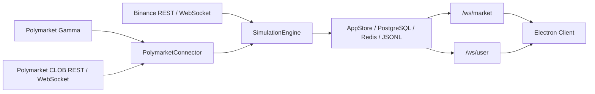
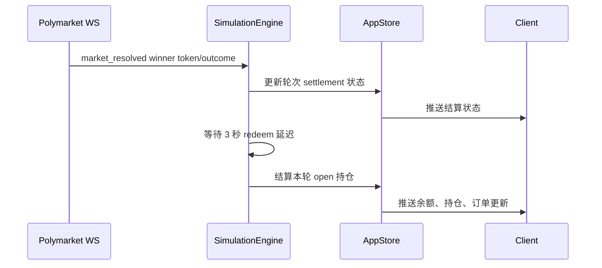

# 架构说明

本项目是一个 BTC 5 分钟涨跌纸面交易系统。当前目标是尽量对齐 Polymarket 的 BTC 5m UP/DOWN 市场，但所有交易都只在本地模拟，不会向 Polymarket 真实下单。

## 核心规则

- 市场来源：Polymarket Gamma 负责发现当前 BTC 5m 市场，Polymarket CLOB REST 和 market WebSocket 负责盘口、成交和结算状态。
- 行情来源：Binance 负责 BTC 现价和 `1m / 5m` K 线。前端主图显示约 1 小时窗口，并用实时 tick 更新当前 K 线。
- 交易执行：系统不再用本地用户订单互相撮合来决定主订单成交。所有成交都根据实时 Polymarket CLOB 外部盘口快照模拟。
- 市价单：按 FOK 处理。下单时读取最新 Polymarket 盘口并逐档吃价，能全部成交才成功，深度不足则整单失败。
- 限价单：按 GTC 处理。当前盘口可全部成交则立即成交，否则成为本地 `pending` 纸面订单，可撤单。pending 单只等待后续 Polymarket 外部盘口触发，不影响公共盘口。
- 买入 pending：冻结 USDC，撤单、失败或结算时释放。
- 卖出 pending：冻结对应持仓数量，撤单、失败或成交时释放或扣减。
- 结算：以 Polymarket `market_resolved` 的 winner token/outcome 为准。后端收到结算状态后等待 3 秒，再模拟 redeem 本轮 open 持仓并把余额返回钱包。

## 服务划分

- [apps/server/src/index.ts](/D:/P_T/apps/server/src/index.ts)：Fastify HTTP/WebSocket 入口，提供登录、行情、订单、持仓、日志和系统状态接口。
- [apps/server/src/services/simulation.ts](/D:/P_T/apps/server/src/services/simulation.ts)：主业务引擎，负责编排市场同步、纸面订单执行、pending 限价单触发、撤单、平仓、结算和日志。
- [apps/server/src/services/clob-execution.ts](/D:/P_T/apps/server/src/services/clob-execution.ts)：Polymarket CLOB 深度估算纯函数，负责逐档吃单、限价约束和成交结果计算。
- [apps/server/src/services/connectors/polymarket.ts](/D:/P_T/apps/server/src/services/connectors/polymarket.ts)：Polymarket 接入层，负责市场发现、CLOB 盘口、最近成交、market WebSocket 和 resolved 状态。
- [apps/server/src/services/connectors/binance.ts](/D:/P_T/apps/server/src/services/connectors/binance.ts)：Binance 行情接入层，维护 BTC 现价和 `1m / 5m` K 线。
- [apps/server/src/services/store.ts](/D:/P_T/apps/server/src/services/store.ts)：内存、PostgreSQL、Redis 和 JSONL 日志的统一存储层。
- [apps/client/src/App.tsx](/D:/P_T/apps/client/src/App.tsx)：Electron/React 主界面，包含 K 线、交易面板、盘口、最近 10 轮、持仓和订单日志。

独立 matching 服务代码仍保留给调试、历史回放或后续扩展，但主交易链路已经不再通过本地 matching 订单簿执行。

## 数据流



## 订单生命周期

### Market FOK

1. 用户提交买入或卖出。
2. 后端读取最新 Polymarket CLOB 盘口。
3. `clob-execution.ts` 按盘口逐档估算成交。
4. 如果可全部成交，订单记为 `filled`，写入成交明细并更新余额/持仓。
5. 如果深度不足，订单记为 `failed`，不改变持仓。

### Limit GTC

1. 用户提交限价买入或卖出。
2. 后端读取最新 Polymarket CLOB 盘口。
3. 如果按限价可全部成交，订单立即 `filled`。
4. 如果不能全部成交，订单进入 `pending`。
5. 买入 pending 冻结 USDC；卖出 pending 冻结持仓数量。
6. 后续 reconcile 周期用新的 Polymarket 盘口重新尝试成交。
7. 用户可以撤销 pending 订单，系统释放冻结资产并记录 `cancelled`。

## 结算流程



结算字段会记录到轮次中，包括 Polymarket 结算状态、结算价格、结算来源、接收时间和 redeem 计划时间。前端最近 10 轮会同时展示 Binance 开/收盘价和 Polymarket 结算信息。

## 前端展示

- 主图只提供 `1m / 5m`，显示 Binance K 线、当前价、Polymarket price to beat 和当前 5 分钟轮次起止线。
- 最近 10 轮显示 Binance 开盘价、Binance 收盘价、Polymarket 结算状态、结算价、胜负结果、信息源和延迟。
- 交易面板支持买入/卖出、UP/DOWN、市价/限价、金额/数量、限价输入和 CLOB 延迟标注。
- 主交易页订单表和个人页订单日志都支持 pending 撤单。
- 持仓日志显示盘口轮次、方向、均价、锁定数量、当前盘口 bid/ask、当前总价值和来源延迟。
- 订单日志显示类型、盘口轮次、方向、金额、数量、均价、生命周期状态和来源延迟。

## 验证命令

常用检查：

```bash
npm run typecheck
npm run test:trading
npm run build
```

## 2026-04-25 Update

### Realtime Settlement Update

- Market snapshot publishing now uses a fast path: current round sync, order book display, Binance candles, live position marking, and `/ws/market` publishing continue around the 1 second cadence.
- Gamma settlement polling now runs as a per-round background task with a per-round lock. Slow Gamma requests no longer block current market snapshots.
- `POLL_DELAY_MS` now defaults to `0`, so ended rounds start Gamma settlement polling immediately instead of waiting 120 seconds.
- CLOB `market_resolved` remains only a trigger; final `settledSide`, `settlementPrice`, and `settlementSource` still come from Gamma.
- Recent 10 rounds now focus on market results: Polymarket UP open/close, Binance BTC open/close, market direction, and user PnL.
- Frontend source badges separate transport latency from data age. Backend-to-frontend latency is fixed at websocket receipt time instead of growing while the page is idle.
- Trade page `Total PnL` is realized PnL only, using `profile.realizedPnlToday`.

- Final settlement uses Gamma as the single source of truth.
- Historical 5m rounds now resolve through Gamma `GET /markets/{id}` when slug lookup returns an empty list.
- Rounds that were stuck in `Manual` due to old Gamma lookup failures are re-armed automatically and moved back into `Polling`.
- Settlement lifecycle is explicit: `Polling -> Settled -> Redeeming -> Closed`.
- After settlement confirmation, the engine waits 3 seconds, redeems every still-open position in that round, returns payout to the wallet, closes the position, and writes a user-visible settlement audit log.
- Only positions in the current active round participate in live mark-to-market.
- Ended but unresolved positions are treated as `Pending Settlement` and excluded from live profile `positionValue` and `unrealizedPnl`.
- Frontend countdown is aligned by `snapshot.serverNow + snapshot.uiMeta.countdownMs` and keeps ticking locally between market pushes.

`npm run test:trading` 会验证 Polymarket CLOB 逐档吃价、市价 FOK、限价 pending、深度不足失败和 500 笔 pending 订单压力估算。
