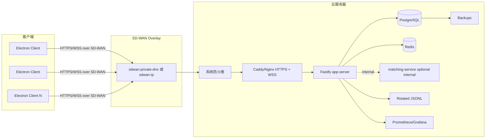

# BTC 5 分钟涨跌模拟盘项目架构、部署距离与优化计划

> 给 Codex / 后续开发者 / 部署维护人员阅读和执行。  
> 本版重点：把旧的“待实现计划”更新为“当前仓库文件清单显示已经具备若干上线模块，但必须核验后部署”的执行方案。  
> 重要限制：当前环境无法直接解压 RAR 源码逐行核验；本文中凡涉及“已存在”的描述，仅表示压缩包文件清单出现对应文件或脚本，不代表实现已经正确。Codex 必须运行文中验收命令确认。

---

## 0. 当前结论

项目已经具备 BTC 5 分钟 UP/DOWN paper trading 的 C/S 架构基础：Electron + React 客户端、Fastify + TypeScript 后端、PostgreSQL、Redis、JSONL 审计、Polymarket/Binance/Chainlink 外部源。旧版文档中的多数 P0/P1 事项已经在压缩包清单里出现对应文件，例如 migration、权限模块、日志异步 writer、metrics、Caddy/Prometheus/Grafana、交易幂等和事务检查脚本。

但距离正式部署还差 **10 个必须完成或验证的功能组**：

```text
1. 部署包清理：排除 data/postgres、data/logs、.env、dist、node_modules。
2. DB migration：空库/旧库迁移、schema check、备份恢复演练。
3. 生产配置强校验：JWT、CORS、DB、Redis、export secret、strict persistence。
4. 密码 hash 与权限边界：四角色权限、Test Engineer 不越权、个人密码修改。
5. 交易一致性：下单/撤单/pending/redeem 事务化、订单幂等、redeem 幂等。
6. WebSocket：ticket、heartbeat、连接上限、backpressure、公共 market payload。
7. JSONL：异步写入、轮转、shutdown flush、失败指标。
8. 监控：health/live、health/ready、metrics、Prometheus/Grafana、告警。
9. 客户端生产打包：远端 HTTPS/WSS 配置，不再依赖本地 127.0.0.1。
10. SD-WAN 云服务器部署流程：只在 SD-WAN/反代入口开放服务，PG/Redis 内网隔离。
```

部署判断：

```text
可做 staging 部署：可以。
可直接正式给客户使用：不建议，必须先完成 P0 验收和 30-50 客户端浸泡测试。
核心业务新增功能：不是主要缺口。
生产交付缺口：配置、封包、迁移、备份、WS、监控、故障演练。
```

---

## 1. 当前仓库文件清单显示的能力

压缩包文件清单显示存在以下关键路径：

```text
apps/client/src/App.tsx
apps/client/src/store/useAppStore.ts
apps/client/src/utils/api.ts
apps/client/src/features/profile/PersonalHomePage.tsx
apps/client/src/features/trade/PositionPnlBreakdown.tsx
apps/client/src/features/trade/pnl.ts
apps/client/electron/main.cjs
apps/client/electron/preload.cjs

apps/server/src/index.ts
apps/server/src/config.ts
apps/server/src/domain/types.ts
apps/server/src/http-errors.ts
apps/server/src/auth/authz.ts
apps/server/src/auth/password.ts
apps/server/src/auth/permissions.ts
apps/server/src/auth/scope.ts
apps/server/src/services/store.ts
apps/server/src/services/simulation.ts
apps/server/src/services/clob-execution.ts
apps/server/src/services/clob-fees.ts
apps/server/src/services/dataset-export.ts
apps/server/src/services/log-writer.ts
apps/server/src/services/metrics.ts
apps/server/src/services/bulk-users.ts
apps/server/src/services/csv-zip-export.ts
apps/server/src/services/connectors/binance.ts
apps/server/src/services/connectors/polymarket.ts
apps/server/src/services/connectors/chainlink.ts
apps/server/src/services/connectors/network.ts

apps/server/src/services/matching/app.ts
apps/server/src/services/matching/client.ts
apps/server/src/services/matching/order-book.ts
apps/server/src/services/matching/service.ts
apps/server/src/services/matching/store.ts

 db/migrations/000000_initial_schema.sql
 db/migrations/000001_user_management_compat.sql
 db/migrations/000002_production_hardening.sql
 db/migrations/000003_redeem_ledger.sql
 db/migrations/000004_order_client_idempotency.sql

scripts/db-backup.sh
scripts/db-restore.sh
scripts/db-migrate.ts
scripts/migration-smoke-check.ts
scripts/order-transactions-check.ts
scripts/redeem-idempotency-check.ts
scripts/order-idempotency-check.ts
scripts/jsonl-rotation-check.ts
scripts/deployment-readiness-check.ts
scripts/fault-tolerance-check.ts
scripts/metrics-check.ts
scripts/package-win-prod.cjs
scripts/package-win-test.cjs

deploy/Caddyfile
deploy/prometheus/prometheus.yml
deploy/prometheus/alerts.yml
deploy/grafana/dashboards/btc-paper-trading.json
```

Codex 不能因为文件存在就跳过核验。第一步必须打开实现并确认：

```text
1. 是否真的被 app-server 引用。
2. 是否在 package.json 中有脚本入口。
3. 是否有测试覆盖。
4. 是否满足生产失败即 fail fast。
5. 是否与前端 DTO 兼容。
6. 是否不会破坏旧数据。
```

---

## 2. 推荐生产拓扑

### 2.1 单云服务器 + SD-WAN C/S 拓扑



要求：

```text
1. 云服务器对公网只开放必要的 SSH/SD-WAN 管理入口；业务入口优先仅绑定 SD-WAN IP。
2. Electron 客户端连接 https://<sdwan-private-domain> 或 https://<sdwan-ip>。
3. app-server、matching-service、PostgreSQL、Redis 不直接暴露公网。
4. Caddy/Nginx 处理 HTTPS 和 WebSocket upgrade。
5. PostgreSQL 是权威存储；Redis 是缓存/限流/WS ticket/状态辅助。
6. JSONL 是审计备份，不是权威交易状态。
7. 单 app-server 先稳定运行，暂不做多实例横向扩展。
```

### 2.2 不建议当前直接多实例

当前架构仍有大量内存热状态和轮次引擎逻辑。即使数据库已有 migration，不能在没有消息总线和分布式锁的情况下直接启动多个 app-server 副本。

多实例前提：

```text
1. 交易命令事件化。
2. Market/Simulation Engine 独立为单 active leader。
3. redeem/pending/settlement 有 DB/advisory lock/job queue。
4. WS Gateway 只做推送，不执行交易。
5. Redis Streams/NATS/Kafka 承载事件。
```

当前正式部署建议：单 app-server + 单 PostgreSQL + 单 Redis + 内网 matching-service。

---

## 3. P0：部署前必须完成的架构任务

### P0-1：部署包清理

#### 问题

压缩包清单显示包含：

```text
.env
data/logs/*.jsonl
data/postgres/**
dist/**
```

这些不应进入源码交付包或 Docker build context。

#### Codex 修改目标

新增/更新：

```text
.gitignore
.dockerignore
scripts/build-release-bundle.sh 或 scripts/package-release.ts
README.md
docs/PACKAGING_AND_SDWAN_DEPLOYMENT_WORKFLOW.md
```

`.dockerignore` 必须包含：

```text
node_modules
npm-debug.log
.env
.env.*
!.env.example
!.env.production.example
data
backups
dist
release
*.rar
*.zip
.git
.vscode
.DS_Store
```

源码压缩包必须排除：

```text
data/
backups/
.env
dist/
node_modules/
```

#### 验收

```bash
bash scripts/build-release-bundle.sh
# 或 npx tsx scripts/package-release.ts

tar -tf release/*.tar.gz | grep -E '(^|/)(data|backups|\.env$|node_modules|dist)' && exit 1 || true
```

---

### P0-2：生产配置 fail fast

#### 目标

生产环境不能带默认弱配置启动。

#### 必填变量

```env
NODE_ENV=production
DEPLOY_ENV=production
PORT=8787
PUBLIC_BASE_URL=https://papertrade.example.internal
CORS_ORIGIN=https://papertrade.example.internal
DATABASE_URL=postgresql://paper_app:<strong-password>@postgres:5432/paper_trading
REDIS_URL=redis://redis:6379
JWT_SECRET=<32 bytes or stronger random secret>
EXPORT_ANONYMIZATION_SECRET=<32 bytes or stronger random secret>
SERVER_STRICT_PERSISTENCE=true
PERSISTENCE_MODE=external
SEED_DEFAULT_USERS=false
ALLOW_DEFAULT_PASSWORD_LOGIN=false
EMBEDDED_MATCHING_SERVICE=false
MATCHING_SERVICE_URL=http://matching-service:8788
TRUST_PROXY=true
LOG_DIR=/app/data/logs
```

#### Codex 核验点

```text
1. JWT_SECRET 不能等于默认值。
2. DATABASE_URL 不能使用 postgres/postgres 默认密码。
3. CORS_ORIGIN 生产必须显式配置。
4. EXPORT_ANONYMIZATION_SECRET 生产必须显式配置。
5. SERVER_STRICT_PERSISTENCE=true 时，PG 写失败必须阻断交易。
6. SEED_DEFAULT_USERS=false 时，不自动创建默认 admin/tester。
7. ALLOW_DEFAULT_PASSWORD_LOGIN=false 时，默认密码无法登录。
```

#### 验收

```bash
npm run test:config
NODE_ENV=production JWT_SECRET=btc-paper-trading-secret npm run start:server
# 预期：启动失败
```

---

### P0-3：数据库 migration、schema check、备份恢复

#### 目标

所有生产 schema 变化走 migration；服务启动检查 schema 版本；升级前可备份，失败可恢复。

#### 当前清单显示

```text
db/migrations/000000_initial_schema.sql
db/migrations/000001_user_management_compat.sql
db/migrations/000002_production_hardening.sql
db/migrations/000003_redeem_ledger.sql
db/migrations/000004_order_client_idempotency.sql
scripts/db-backup.sh
scripts/db-restore.sh
scripts/db-migrate.ts
scripts/migration-smoke-check.ts
```

#### Codex 必须验证

```bash
npm run db:status
npm run db:migrate
npx tsx scripts/migration-smoke-check.ts
npm run db:backup
BACKUP_FILE=backups/<file>.dump npm run db:restore
```

#### store.ts 要求

生产环境不允许 `store.ts` 静默执行大规模：

```sql
CREATE TABLE IF NOT EXISTS ...
ALTER TABLE ... ADD COLUMN ...
```

允许开发环境初始化兜底，但生产必须靠 migration。

---

### P0-4：交易关键写入事务化

#### 必须事务化的链路

```text
1. 买入：用户余额 + order + position + lifecycle + audit。
2. 卖出：用户余额 + order + position + lifecycle + audit。
3. 撤单：释放 frozen/locked + order 状态 + position/user 保存。
4. pending fail/expire：释放冻结资产 + order 状态。
5. redeem：round + position close + user balance + lifecycle + audit + redeem ledger。
6. 用户权限变更：user + audit。
7. dataset export：export audit + manifest/file metadata。
```

#### Codex 必须验证

压缩包清单显示已有脚本：

```text
scripts/order-transactions-check.ts
scripts/redeem-idempotency-check.ts
scripts/order-idempotency-check.ts
```

必须运行：

```bash
npx tsx scripts/order-transactions-check.ts
npx tsx scripts/redeem-idempotency-check.ts
npx tsx scripts/order-idempotency-check.ts
```

#### 失败即阻断部署

```text
1. 模拟写订单失败，用户余额不得变化。
2. 模拟写持仓失败，订单不得落库。
3. 重复 clientOrderId 不重复扣款。
4. 重复 redeem 不重复加钱。
5. PG 不可写时严格模式禁止交易。
```

---

### P0-5：身份安全与权限范围

#### 当前清单显示

```text
apps/server/src/auth/authz.ts
apps/server/src/auth/password.ts
apps/server/src/auth/permissions.ts
apps/server/src/auth/scope.ts
```

#### 必须验证

```text
1. 新用户只存 password_hash，不存明文。
2. 旧明文用户登录成功后可迁移到 hash。
3. Tester 可在 Profile 修改密码。
4. Test Engineer 不可查看 Admin 日志或 Admin 用户数据。
5. Senior Tester 只能看自己团队。
6. Admin 可全局管理。
7. 权限变更、密码重置、越权尝试写 audit。
```

#### 验收

```bash
npm run test:permissions
npx tsx scripts/user-permission-check.ts
```

---

### P0-6：WebSocket ticket、heartbeat、连接上限和 backpressure

#### 目标

生产环境不得长期使用 JWT query 作为 WS 鉴权；慢客户端不得拖垮服务端。

#### 推荐协议

```text
POST /api/auth/ws-ticket
Authorization: Bearer <jwt>

返回：
{
  "ticket": "...",
  "expiresAt": 1234567890
}

连接：
wss://host/ws/market?ticket=...
wss://host/ws/user?ticket=...
```

#### 服务端要求

```text
1. ticket 60 秒内有效。
2. Redis 可用时 ticket nonce 单次使用。
3. 生产禁用 /ws/*?token=<long-jwt>。
4. 服务端 25-30 秒 ping。
5. 未 pong 关闭连接。
6. 每用户每 channel 最大连接数，例如 3。
7. 连接关闭清理 listener、timer、pending retry。
8. bufferedAmount 超阈值时跳过中间 market delta，只保留最新 snapshot。
```

#### 客户端要求

```text
1. WS 重连前重新申请 ticket。
2. 收到 seq gap 或 full_sync_required 后主动拉 full sync。
3. 鉴权失败不要无限快速重连。
```

#### 验收

```bash
npx tsx scripts/deployment-readiness-check.ts
# 如已有 ws-load 脚本，也必须运行
```

人工验收：30 个客户端同时在线 30 分钟，连接数不泄漏，CPU/内存稳定。

---

### P0-7：JSONL 异步日志与轮转

#### 当前清单显示

```text
apps/server/src/services/log-writer.ts
scripts/jsonl-rotation-check.ts
```

#### 必须验证

```bash
grep -R "appendFileSync\|writeFileSync\|readFileSync" apps/server/src
npx tsx scripts/jsonl-rotation-check.ts
```

要求：

```text
1. 高频审计/训练日志路径不得使用同步 append/write。
2. 写入使用队列和 stream backpressure。
3. 按日期或大小轮转。
4. shutdown flush。
5. 写入失败可观测，但不悄悄吞掉。
```

---

### P0-8：监控、健康检查和告警

#### 当前清单显示

```text
apps/server/src/services/metrics.ts
deploy/prometheus/prometheus.yml
deploy/prometheus/alerts.yml
deploy/grafana/dashboards/btc-paper-trading.json
scripts/metrics-check.ts
scripts/monitoring-deploy-check.ts
```

#### 必须提供 endpoint

```text
GET /api/health/live
GET /api/health/ready
GET /metrics 或 GET /api/metrics
```

ready 必须覆盖：

```text
PostgreSQL 可查询
Redis 可连接或明确 degraded
schema 版本正确
日志目录可写
外部源状态可返回 degraded，但不能假装 healthy
内存与 event loop lag 未超保护阈值
```

#### 验收

```bash
npx tsx scripts/metrics-check.ts
npx tsx scripts/monitoring-deploy-check.ts
```

---

### P0-9：Docker、Caddy/Nginx、云服务器隔离

#### 生产 compose 要求

```text
1. 只对外暴露 Caddy/Nginx 的 443/80 或只绑定 SD-WAN IP。
2. app-server、matching-service 不映射公网端口。
3. PostgreSQL、Redis 不映射公网端口。
4. PG/Redis 使用 volume。
5. logs/backups 使用 volume。
6. restart: unless-stopped。
7. healthcheck 生效。
8. 环境变量来自 .env.production，不把真实 .env 打进镜像。
9. Dockerfile 不 COPY data。
10. Node 服务使用非 root 用户运行。
```

#### 验收

```bash
docker compose -f docker-compose.deploy.yml config
docker compose -f docker-compose.deploy.yml up -d
npx tsx scripts/deployment-readiness-check.ts
```

从公网扫描：

```text
8787 不应直接开放。
8788 不应直接开放。
5432 不应开放。
6379 不应开放。
```

---

### P0-10：Electron 客户端生产配置

#### 目标

生产客户端必须连接云服务器，不再启动内嵌本地后端。

#### 配置要求

```env
VITE_API_BASE_URL=https://papertrade.example.internal
VITE_WS_BASE_URL=wss://papertrade.example.internal
VITE_CLIENT_DEPLOY_MODE=cs_remote
```

#### Codex 必须验证

```bash
npx tsx scripts/electron-config-check.ts
node scripts/package-win-prod.cjs
```

验收：

```text
1. 安装包启动后访问远端 HTTPS/WSS。
2. 不依赖 127.0.0.1:8787。
3. token/ticket 与生产服务匹配。
4. SD-WAN 未连接时，客户端给出明确连接失败提示。
```

---

## 4. P1：正式部署前的性能与体验优化

### P1-1：公共 market payload 缓存

market 数据中不应混入用户个人历史/PnL。服务端每个 tick 应只构造一次公共 market payload，然后广播给所有连接。

用户数据通过 user WS delta 推送：

```ts
{ type: "profile", data }
{ type: "order_upsert", data }
{ type: "position_upsert", data }
{ type: "log_append", data }
{ type: "operated_round_upsert", data }
{ type: "full_sync", data }
{ type: "full_sync_required", reason }
```

验收：30 个客户端在线时，market payload 每 tick 构造次数为 1，而不是 N。

### P1-2：前端渲染分片

当前清单显示仍有大型 `apps/client/src/App.tsx`，同时已有少量 `features/` 文件。Codex 应继续拆分，但不应重写整页。

推荐结构：

```text
apps/client/src/app/App.tsx
apps/client/src/features/auth/*
apps/client/src/features/market/*
apps/client/src/features/trade/*
apps/client/src/features/profile/*
apps/client/src/features/users/*
apps/client/src/features/logs/*
apps/client/src/store/useAuthStore.ts
apps/client/src/store/useMarketStore.ts
apps/client/src/store/useUserDataStore.ts
apps/client/src/store/useUiStore.ts
```

原则：先搬代码，再跑 typecheck/build，再优化 selector。

### P1-3：日志搜索与导出流式化

日志搜索必须使用 keyset pagination；大导出必须流式生成或后台 job，不能一次性把十万行读进内存。

验收：导出 10 万行时，WS heartbeat 和下单不被明显阻塞。

### P1-4：外部连接器退避和降级

Polymarket、Binance、Chainlink 请求必须有：

```text
timeout
exponential backoff + jitter
请求并发上限
circuit breaker
stale/degraded 状态
```

CLOB 盘口 stale 超阈值时禁止新下单。

---

## 5. P2：更长期的架构演进

当用户数达到数百或需要多机高可用时，再做：

```text
1. market-engine 独立服务。
2. api-service 独立服务。
3. ws-gateway 独立服务。
4. Redis Streams/NATS 事件总线。
5. PostgreSQL advisory lock 或 job queue 控制 settlement/redeem。
6. Prometheus + Alertmanager + Grafana 完整监控。
7. 对象存储归档备份。
```

当前阶段不要直接做多实例 app-server。

---

## 6. Codex 执行任务卡

### Task A：源码现状核验

```text
目标：打开源码逐项确认文件清单中的能力是否真实实现。
输出：更新 docs/codex-current-state-audit.md。
禁止：不要修改业务代码。
验收：列出已实现、未实现、实现但不合格、部署阻断项。
```

### Task B：部署包治理

```text
目标：排除 data/.env/dist/node_modules，生成干净 release 包。
修改：.gitignore、.dockerignore、release 脚本、README、打包文档。
验收：release 包不包含敏感/本地数据。
```

### Task C：生产配置和 Docker/Caddy

```text
目标：云服务器 compose 可稳定启动，只暴露反代入口。
修改：docker-compose.deploy.yml、Dockerfile.server、deploy/Caddyfile、.env.production.example。
验收：PG/Redis/matching 不对公网开放，ready 通过。
```

### Task D：数据库迁移和备份恢复

```text
目标：空库/旧库可迁移，备份可恢复，schema 不匹配启动失败。
修改：db/migrations、scripts/db-*、schema-check。
验收：migration-smoke、backup/restore 通过。
```

### Task E：交易一致性核验

```text
目标：下单、撤单、pending、redeem 事务化与幂等。
修改：store.ts、simulation.ts、migrations、相关测试脚本。
验收：order-transactions、order-idempotency、redeem-idempotency 通过。
```

### Task F：WS 安全和负载

```text
目标：ticket、heartbeat、连接上限、backpressure、full sync fallback。
修改：index.ts、ws manager、api.ts、前端 WS hooks。
验收：30-50 客户端浸泡测试通过。
```

### Task G：日志、metrics、故障演练

```text
目标：JSONL 异步轮转、metrics、fault tolerance。
修改：log-writer、metrics、health endpoint、deploy/prometheus。
验收：jsonl-rotation、metrics、fault-tolerance 通过。
```

### Task H：客户端生产打包

```text
目标：Electron 客户端连接 SD-WAN 云服务器。
修改：electron main/preload、api config、package-win-prod。
验收：安装包启动后只连远端 HTTPS/WSS。
```

### Task I：文档清理

```text
目标：删除过时 docs，保留一个执行来源。
修改：docs/README.md、docs/docs-cleanup-manifest.md。
删除：用户权限导出旧文档、storage 旧文档、progress.md。
验收：Codex 不再读取旧任务卡重复执行。
```

---

## 7. 上线前最终验收矩阵

| 类别 | 必须通过 |
|---|---|
| 构建 | `npm ci`、`npm run typecheck`、`npm run build`。 |
| 配置 | `npm run test:config`；生产弱配置启动失败。 |
| 数据库 | `db:migrate`、`db:status`、migration smoke、backup/restore。 |
| 权限 | 四角色权限矩阵；Test Engineer 不可访问 Admin 数据。 |
| 交易 | 下单、撤单、pending、卖出、反手、结算、redeem。 |
| 一致性 | PG 故障注入不半写；clientOrderId 幂等；redeem 幂等。 |
| WS | ticket、heartbeat、连接限制、seq gap、full sync、backpressure。 |
| 日志 | JSONL 异步、轮转、flush、失败指标。 |
| 监控 | live/ready/metrics、Prometheus、Grafana、告警。 |
| Docker | 不暴露 PG/Redis/matching；不 COPY data；非 root 运行。 |
| 客户端 | 生产包连接远端 HTTPS/WSS，SD-WAN 断开有明确提示。 |
| 性能 | 30-50 客户端浸泡；导出大数据不阻塞交易。 |
| 运维 | 备份恢复、回滚流程、SD-WAN 部署流程文档可执行。 |

---

## 8. 给 Codex 的一句话指令

先核验，不要重复造轮子；先清理部署包和生产配置，再跑 migration/备份/交易一致性/WS/日志/监控测试；确认全部 P0 通过后，按 `docs/PACKAGING_AND_SDWAN_DEPLOYMENT_WORKFLOW.md` 做云服务器 + SD-WAN staging 部署，再做 30-50 客户端浸泡测试，最后才进入正式部署。
